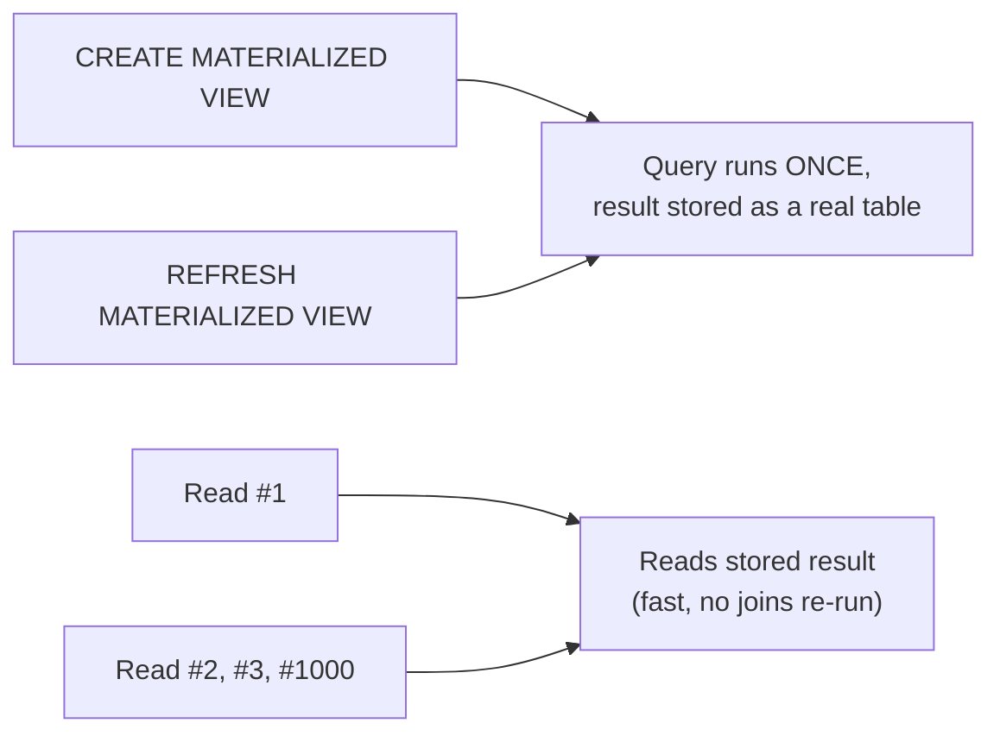

# Views — Middle

<!-- level-focus -->
At middle level, focus on this question:

> How does a materialized view trade freshness for speed, and what refresh
> strategies exist?

Prerequisite: [`junior.md`](junior.md).

---

## Materialized views store the result

```sql
CREATE MATERIALIZED VIEW order_summary AS
SELECT o.order_id, c.name, SUM(oi.quantity * p.price) AS total
FROM orders o
JOIN customers c ON o.customer_id = c.customer_id
JOIN order_items oi ON oi.order_id = o.order_id
JOIN products p ON p.product_id = oi.product_id
GROUP BY o.order_id, c.name;

-- Reading it is now just reading a table - no joins re-run
SELECT * FROM order_summary WHERE total > 1000;
```



Reads are now as fast as reading any regular table — no join cost per query.
The trade: the data is frozen as of the last `REFRESH`, and **will not
reflect new writes to the underlying tables until you explicitly refresh
it.**

## Refresh strategies

| Strategy | How | Trade-off |
|---|---|---|
| **Manual `REFRESH`** | Someone or something explicitly runs `REFRESH MATERIALIZED VIEW order_summary;` | Full control over timing, but easy to forget or under-schedule. |
| **Scheduled refresh** | A cron job / Airflow task runs `REFRESH` on a fixed interval. | Predictable staleness window (e.g. "at most 1 hour old"), simple to reason about. |
| **`REFRESH ... CONCURRENTLY`** (Postgres) | Rebuilds the view without locking out readers during the refresh. | Slower than a plain refresh, requires a unique index on the view, but avoids blocking queries mid-refresh. |
| **Triggered refresh** | A trigger or downstream event kicks off a refresh after a relevant write. | Freshest option short of incremental refresh, but can create refresh storms under high write volume. |

## Full refresh cost scales with data size, not with what changed

```sql
REFRESH MATERIALIZED VIEW order_summary;
-- re-runs the ENTIRE underlying query from scratch, even if only
-- 10 new orders were added since the last refresh
```

A full refresh recomputes everything, regardless of how small the actual
change was — for a view over a small table this is fine; for a view over
billions of rows, a full refresh can take longer than your desired refresh
interval, forcing a choice between staleness and refresh cost. This tension
is exactly what makes **incremental refresh** (`senior.md`) worth its added
complexity for large-scale views.

## Test yourself

1. Why does `REFRESH MATERIALIZED VIEW` without `CONCURRENTLY` block readers
   during the refresh, while a regular view never blocks anyone?
2. If a materialized view refreshes every hour, what's the maximum staleness
   an analyst querying it could ever observe?
3. What happens if a full refresh takes 90 minutes but you've scheduled it to
   run every 60 minutes?

Continue to [`senior.md`](senior.md).
