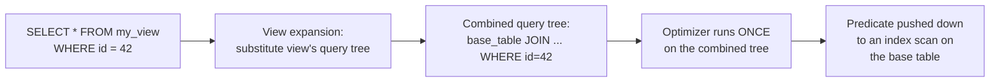
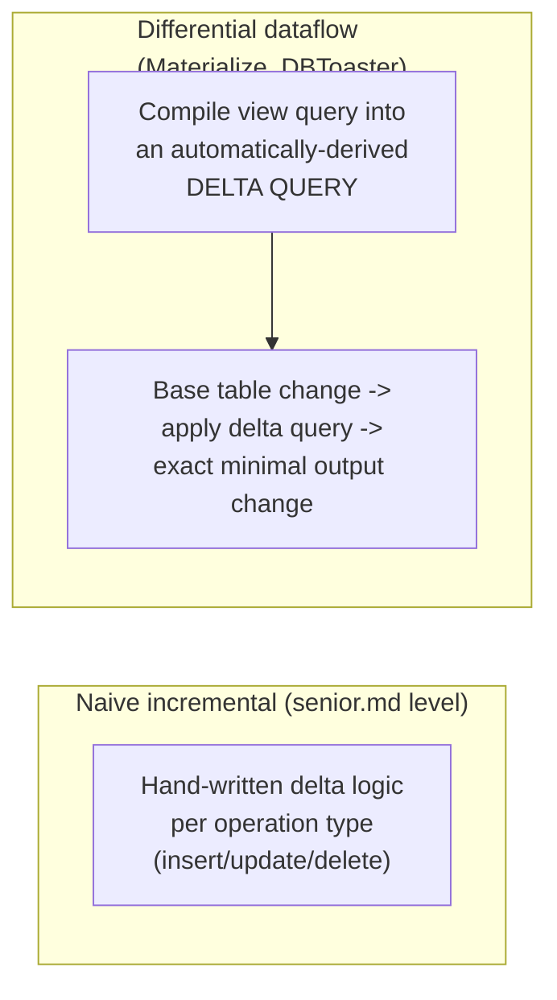

# Views — Professional

<!-- level-focus -->
At professional level, focus on this question:

> How does a query planner actually rewrite a view reference into the base
> query (view expansion), and how do incremental materialized view
> maintenance algorithms work under the hood?

Prerequisite: [`senior.md`](senior.md).

---

## View expansion: what the planner literally does with `CREATE VIEW`

A regular view is stored in the catalog as a parsed query tree (Postgres:
`pg_rewrite` rules), not as text re-parsed on every use. When a query
references a view, the planner performs **view expansion**: it textually/
structurally substitutes the view's stored query tree into the outer query's
`FROM` clause **before** optimization runs, then optimizes the *combined*
query as a single unit. This has a critical consequence most engineers miss:
`SELECT * FROM my_view WHERE id = 42` doesn't run the view's query and then
filter the result — the planner can push the `WHERE id = 42` predicate
**down into** the view's own definition if the view's structure allows it
(this is called **predicate pushdown through a view**), potentially turning
an unindexed full-view-scan into an indexed lookup on the base table.



This is *why* views are usually "free" performance-wise for simple cases —
but it's also why a view wrapping a non-pushdown-safe construct (a
`LIMIT`, a window function, an aggregate without a matching `GROUP BY` on
the filtered column) silently prevents this optimization, forcing a full
materialization of the view's result before the outer filter applies. A
staff-level review of a slow "just a view" query should always start by
checking `EXPLAIN` for whether pushdown actually happened, not assuming it
did because the SQL "looks simple."

## Incremental materialized view maintenance: the actual algorithms

Beyond "track a delta and reapply it" (`senior.md`'s framing), production
incremental view maintenance systems implement specific, formally-grounded
algorithms:

- **Counting algorithm** (for views with aggregation/duplicate elimination):
  rather than storing just the aggregated value, the system maintains a
  **count** alongside each distinct group so that a deleted/updated source
  row can correctly decrement the right group without needing to rescan the
  base table to verify "is this really gone" — this is the specific
  mechanism behind correctly handling deletes in `SUM`/`COUNT` incremental
  views (the "undo logic" `senior.md` mentioned, made precise).
- **DBToaster / higher-order incremental view maintenance**: recent
  academic and production systems (DBToaster, and internally,
  Materialize's implementation of **differential dataflow**) generalize
  incremental maintenance to arbitrarily complex SQL (multi-way joins,
  nested aggregates) by compiling the view's query into a **delta query**
  for each base table — a separate, automatically-derived query that,
  given a small change to one input, computes exactly the corresponding
  small change to the output, without ever touching unaffected rows.
  Materialize's differential dataflow specifically represents every value as
  `(data, time, diff)` triples, allowing incremental recomputation to be
  expressed as pure incremental algebra rather than hand-written
  insert/update/delete-specific logic.



## Production checklist (staff-level)

1. **Verify predicate/projection pushdown through a view actually occurs**
   via `EXPLAIN` for any performance-sensitive query against a view — don't
   assume a view is "free" without checking the combined plan.
2. **Identify which constructs in a view definition block pushdown**
   (`LIMIT`/`OFFSET`, window functions, certain aggregate shapes) before
   publishing it as a "thin" contract layer — these silently convert a cheap
   filtered query into an expensive full materialization.
3. **For high-value incrementally-maintained views, evaluate a
   differential-dataflow-based system (Materialize, or a streaming
   equivalent) rather than hand-rolled delta logic** once the view's query
   complexity (multi-way joins, nested aggregation) exceeds what your
   database's built-in incremental materialized view feature supports
   correctly.
4. **When implementing hand-rolled incremental aggregation, use the
   counting-algorithm pattern (store counts alongside aggregates) rather
   than naive value tracking** — this is the specific, well-known technique
   that makes deletes/updates correct without a full rescan.
5. **In a design review for a proposed materialized view, ask "what's the
   delta query for a single-row change to each base table"** — if nobody
   can answer that precisely, the incremental maintenance plan isn't
   actually designed yet, regardless of what refresh mechanism is proposed.

## Cheat Sheet

```text
+------------------------------------------------------------------+
|                    VIEWS — INTERNALS & SCALE                        |
+------------------------------------------------------------------+
| Regular view = stored query tree, EXPANDED into the outer query       |
| BEFORE optimization -> predicate/projection pushdown can turn a       |
| "scan the whole view" into an indexed base-table lookup - but         |
| LIMIT/window functions/certain aggregates BLOCK pushdown silently      |
+------------------------------------------------------------------+
| Incremental materialized view maintenance, real algorithms:            |
|   Counting algorithm: track counts per group, not just values,         |
|     so deletes/updates decrement correctly without a rescan            |
|   Differential dataflow (Materialize/DBToaster): compile the view      |
|     query into an auto-derived DELTA QUERY per base table - handles    |
|     arbitrary joins/aggregates without hand-written per-op logic       |
+------------------------------------------------------------------+
| Always verify pushdown via EXPLAIN before trusting a view is "free"   |
+------------------------------------------------------------------+
```

## Test yourself

1. A view wraps a query with a `LIMIT 100`. Explain precisely why a
   `WHERE customer_id = 42` filter on a query against this view cannot be
   pushed down into the view's own base-table scan.
2. Why does the "counting algorithm" solve a correctness problem that naive
   incremental `SUM` maintenance gets wrong on deletes?
3. Explain, at a conceptual level, what a "delta query" is in differential
   dataflow, and why deriving one automatically is harder for a multi-way
   join than for a single-table filter.

## Further Reading

- PostgreSQL source/documentation — "Rules System" (`pg_rewrite`, view
  expansion internals) and "Planner: View and Sub-Query Flattening."
- Gupta & Mumick — "Maintenance of Materialized Views: Problems, Techniques,
  and Applications" (the counting algorithm and classical incremental view
  maintenance theory).
- McSherry, Murray, et al. — "Differential Dataflow" (the algebra behind
  Materialize's incremental view maintenance).
- See also: [Query Optimization — professional](../../performance/15-query-optimization/professional.md).
