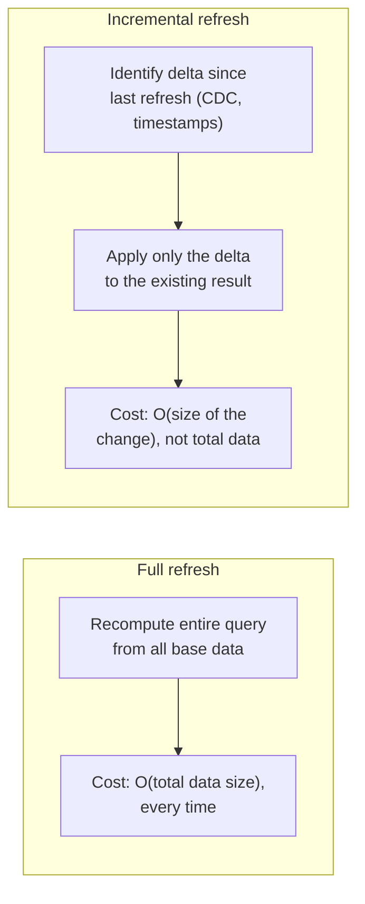
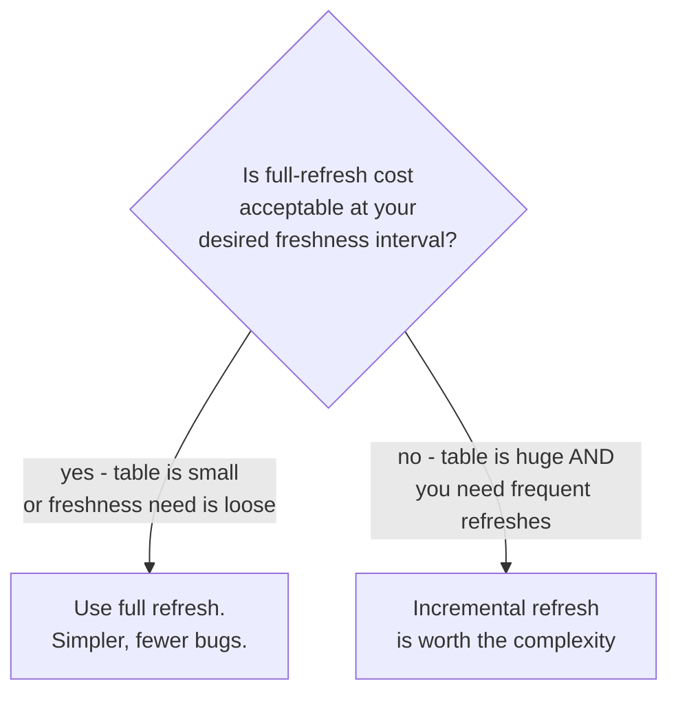

# Views — Senior

<!-- level-focus -->
At senior level, focus on this question:

> Why is incremental refresh harder to implement than full refresh, and when
> is that complexity actually worth it?

Prerequisite: [`middle.md`](middle.md).

---

## Incremental refresh: only process what changed

Instead of recomputing the whole view, an incremental refresh applies just
the **delta** since the last refresh — the new/changed/deleted rows in the
base tables — to the existing materialized result.

## Why it's genuinely harder

- **Aggregations need "undo" logic for updates and deletes.** If a row that
  contributed to `SUM(amount)` is updated or deleted, you can't just add the
  new value — you must subtract the row's old contribution first. This
  requires tracking enough history to know what to undo, not just what to
  add.
- **Joins complicate the delta.** If a dimension row changes (e.g. a
  customer's name), every fact row that joined to it is now stale in the
  materialized result, even though the fact table itself didn't change —
  the delta isn't just "new rows in the fact table."
- **Correctness under concurrent writes.** The delta must correspond to a
  consistent snapshot boundary — capturing "changes since timestamp X"
  incorrectly (e.g. missing a row committed just after your delta query ran)
  silently produces a wrong incremental result that never self-corrects
  without a full refresh.

## When incremental refresh earns its complexity

Modern systems increasingly handle this for you: Postgres extensions,
Snowflake's Dynamic Tables, and BigQuery's materialized views all implement
incremental maintenance internally, tracking base-table changes and applying
them to the materialized result without you hand-writing delta logic —
**prefer a system's built-in incremental materialized view support before
building your own delta-tracking logic.**

> 🎯 **Senior takeaway:** incremental refresh is a genuine engineering
> investment, not a free upgrade over full refresh. Reach for it only when
> you've confirmed full refresh can't hit your required freshness interval
> at your data's current (and near-future) scale — and prefer a database's
> built-in incremental materialized view feature over a hand-rolled one.

## Test yourself

1. A materialized view computes `SUM(amount) GROUP BY customer_id`. A row
   with `amount=50` for customer X gets updated to `amount=80`. Walk through
   exactly what an incremental refresh must do to keep the sum correct.
2. Why does a dimension-table change (e.g. renaming a product category)
   require touching every joined fact row in the materialized result, even
   though the fact table had zero actual writes?
3. Why should you generally prefer a database's built-in incremental
   materialized view feature over hand-rolling delta-tracking logic
   yourself?

Continue to [`professional.md`](professional.md) to use views as a contract
layer over pipeline output.
