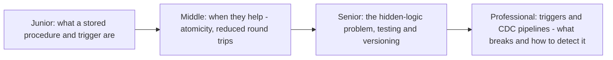
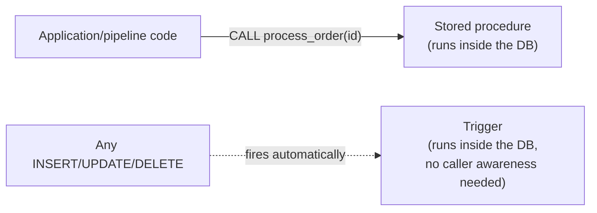

# Stored Procedures & Triggers

> Code that lives inside the database, running close to the data instead of
> in application/pipeline code. Powerful for atomicity and performance;
> notorious for becoming invisible logic that no data engineer discovers
> until a migration breaks it.

## Choose a level

| Level | Guide | You are done when |
|---|---|---|
| Junior | [What they are](junior.md) | You can explain the difference between explicitly calling a stored procedure and a trigger firing automatically. |
| Middle | [When they help](middle.md) | You can name a concrete case where a stored procedure reduces round trips or guarantees atomicity better than application code. |
| Senior | [The hidden-logic problem](senior.md) | You can explain why triggers are a common source of "the pipeline did something nobody expected" incidents. |
| Professional | [Triggers and CDC pipelines](professional.md) | You can predict how a trigger-heavy source database will behave under CDC, and design around it. |

## Practice rule

Before adding a trigger to a table your pipeline reads from, ask: "will the
next data engineer who inspects this table's rows via CDC or a query be able
to tell this logic ran, just by looking at the row?" If the answer is no,
document it loudly — this is the seed of `senior.md` and `professional.md`.

## Related

- [Transactions & ACID](../../transaction/07-transactions-and-acid/README.md)
- [CDC pipeline (Debezium)](../../../event-streaming/events-driven/01-cdc-pipeline/README.md)
