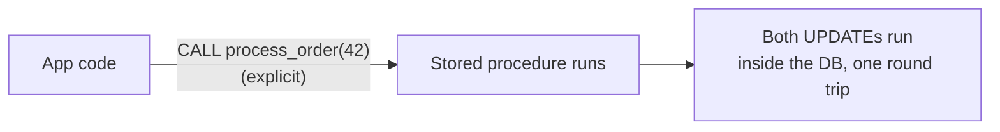
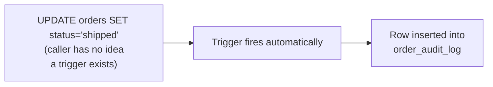

# Stored Procedures & Triggers — Junior

<!-- level-focus -->
At junior level, focus on this question:

> What's the difference between code you explicitly call and code that fires
> automatically on a write?

---

## Stored procedures: code you call explicitly

A **stored procedure** is a named, precompiled block of logic stored inside
the database, invoked explicitly by the caller.

```sql
CREATE PROCEDURE process_order(order_id INT)
LANGUAGE plpgsql AS $$
BEGIN
    UPDATE inventory SET quantity = quantity - 1
    WHERE product_id = (SELECT product_id FROM orders WHERE id = order_id);

    UPDATE orders SET status = 'processed' WHERE id = order_id;
END;
$$;

-- Application calls it explicitly:
CALL process_order(42);
```



The application decides *when* this runs, by calling it — same as calling
any function, except the function's body executes on the database server,
not in the application's process.

## Triggers: code that fires automatically

A **trigger** attaches logic to a table that runs automatically whenever a
matching write happens — no explicit call needed, and the caller doing the
`INSERT`/`UPDATE`/`DELETE` doesn't need to know the trigger exists.

```sql
CREATE FUNCTION log_order_change() RETURNS TRIGGER AS $$
BEGIN
    INSERT INTO order_audit_log (order_id, changed_at, new_status)
    VALUES (NEW.id, NOW(), NEW.status);
    RETURN NEW;
END;
$$ LANGUAGE plpgsql;

CREATE TRIGGER after_order_update
AFTER UPDATE ON orders
FOR EACH ROW EXECUTE FUNCTION log_order_change();
```



Now **any** update to `orders`, from anywhere — the application, a script, an
ad-hoc `psql` session, a pipeline's write-back — automatically logs an audit
entry, with zero coordination required from whoever wrote the update.

> 🎓 **Takeaway:** a stored procedure is logic you invoke; a trigger is logic
> that invokes itself in response to a write, invisibly to the writer. That
> invisibility is exactly what makes triggers both powerful and, at senior
> level, dangerous.

## Test yourself

1. If you `UPDATE orders SET status = 'shipped'` directly (not via
   `process_order`), does the audit-log trigger still fire? Why?
2. What's one advantage of doing both `UPDATE`s inside `process_order` as a
   single stored procedure call, versus the application issuing two separate
   `UPDATE` statements itself?
3. Why does a trigger not require the caller to "know" it exists, while a
   stored procedure requires the caller to explicitly `CALL` it?

Continue to [`middle.md`](middle.md).
