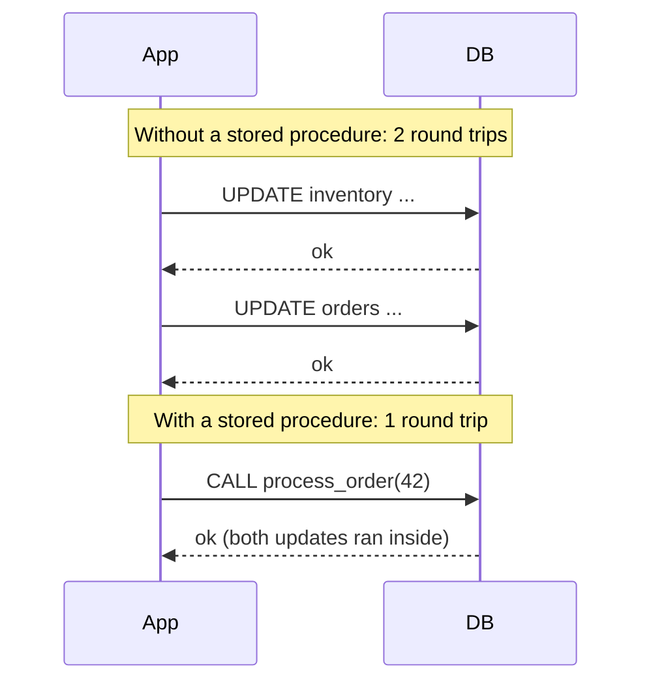

# Stored Procedures & Triggers — Middle

<!-- level-focus -->
At middle level, focus on this question:

> What concrete problems do stored procedures and triggers actually solve
> better than doing the same logic in application/pipeline code?

Prerequisite: [`junior.md`](junior.md).

---

## Fewer round trips



Each network round trip between application and database costs latency. A
procedure bundling several statements into one call executes them all on the
database server in sequence, paying the network cost once instead of once
per statement — meaningful when a workflow involves many small statements
run at high frequency.

## Guaranteed atomicity, close to the data

A procedure's statements typically run inside a single implicit transaction —
easier to guarantee "all these updates happen together" than trusting every
application code path to correctly wrap its own multi-statement sequence in
a transaction. This mirrors the [Transactions & ACID](../../transaction/07-transactions-and-acid/README.md)
guarantee, just enforced at the database layer instead of relying on every
caller to remember `BEGIN`/`COMMIT` correctly.

## Enforcing invariants no matter who writes

```sql
CREATE TRIGGER enforce_non_negative_balance
BEFORE UPDATE ON accounts
FOR EACH ROW
WHEN (NEW.balance < 0)
EXECUTE FUNCTION reject_negative_balance();
```

A trigger enforces a rule **regardless of which application, script, or
future pipeline writes to the table** — unlike an application-level check,
which only protects writes that go through that specific application's code
path. This is valuable when multiple systems write to the same table and you
can't guarantee every one of them implements the same validation.

## The cost side of the ledger

| Cost | Why it matters |
|---|---|
| **Harder to version-control and review** | Logic lives in the database, not necessarily in your Git repo, unless you have strict migration discipline. |
| **Harder to unit test** | Testing requires a real (or realistic) database instance, not a pure function you can call in isolation. |
| **Database-specific syntax** | PL/pgSQL, T-SQL, and PL/SQL are not portable — locking logic into stored procedures ties you to that database vendor more tightly. |
| **Invisible to code review of application changes** | A PR that changes application behavior might not show the trigger silently altering the same data — this is the seed of `senior.md`. |

## Test yourself

1. Why does bundling two `UPDATE`s into one stored procedure call reduce
   latency, specifically — what's being saved?
2. Give an example where a trigger-enforced invariant is safer than an
   application-level check, because multiple systems write to the same
   table.
3. Why is "harder to unit test" a real engineering cost, not just an
   inconvenience — what kind of bug does it make more likely to ship?

Continue to [`senior.md`](senior.md).
