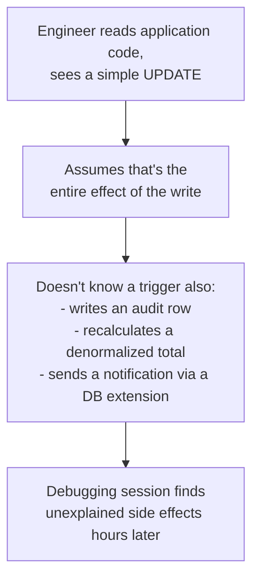

# Stored Procedures & Triggers — Senior

<!-- level-focus -->
At senior level, focus on this question:

> Why do triggers become a recurring source of "nobody knew this logic
> existed" incidents, and how do you manage that risk?

Prerequisite: [`middle.md`](middle.md).

---

## The hidden-logic problem

A trigger is, by design, invisible at the call site — that's precisely what
makes it useful (`middle.md`: enforcement regardless of caller) and precisely
what makes it dangerous: **nothing in the calling code hints that it
exists.** A new engineer reading application code, a data engineer designing
a CDC pipeline, or an incident responder debugging unexpected data changes
all have to separately discover "oh, there's a trigger on this table" —
usually the hard way, mid-incident.

## Real failure patterns this causes

- **Migration surprises.** A schema migration drops a column the application
  never references directly, but a trigger does — the migration succeeds,
  then every subsequent write starts failing with an obscure error inside
  trigger code nobody remembered to update.
- **Performance regressions with no code change.** An `UPDATE` that used to
  take 2ms starts taking 200ms after someone adds an expensive trigger — the
  application code that issues the `UPDATE` looks completely unchanged in
  its own diff.
- **Cascading trigger chains.** A trigger on table A updates table B, which
  has its own trigger that updates table C — the total effect of one write
  becomes a chain that's difficult to trace end-to-end from any single file.
- **Recursive/reentrant surprises.** A trigger that itself performs an
  `UPDATE` on the same table can re-fire itself (depending on the database
  and trigger configuration), producing infinite loops or unexpected
  multiple executions if not carefully guarded.

## Managing the risk

1. **Version-control every trigger and procedure definition** in the same
   repository as application/pipeline code, applied via the same migration
   tooling — never let a DBA or one-off script create logic that only exists
   live in the database with no corresponding commit.
2. **Document triggers loudly at the table level** — a `README` or schema
   comment listing every trigger on a table, so anyone inspecting it doesn't
   have to run `\d+ tablename` (or the equivalent) to discover hidden logic.
3. **Prefer explicit application/pipeline logic over triggers for anything
   business-critical and actively evolving.** Reserve triggers for stable,
   rarely-changing invariants (audit logging, simple validation) where the
   "enforced no matter who writes" property genuinely outweighs the
   discoverability cost.
4. **Test trigger behavior with real integration tests against a real
   database**, not just application-level unit tests that mock the database
   away and never actually exercise the trigger.

> 🎯 **Senior takeaway:** the trade-off from `middle.md` (guaranteed
> enforcement vs. discoverability) tips further toward "avoid triggers" the
> more actively a table's logic evolves, and further toward "triggers are
> fine" the more stable and rarely-touched the invariant is (e.g. an
> immutable audit log that will never change its shape).

## Test yourself

1. A migration drops a column and all application tests pass, but production
   writes start failing an hour later. What's the most likely explanation,
   and how would you have caught it before deploying?
2. Why does a trigger chain (A's trigger updates B, B's trigger updates C)
   make debugging harder than the same total logic written as one explicit
   function call?
3. Propose a lightweight documentation practice that would have prevented the
   "engineer reads application code, doesn't know about the trigger"
   scenario above.

Continue to [`professional.md`](professional.md) to see how this affects a
CDC pipeline built on top of a trigger-heavy source database.
