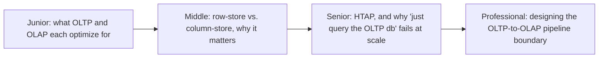
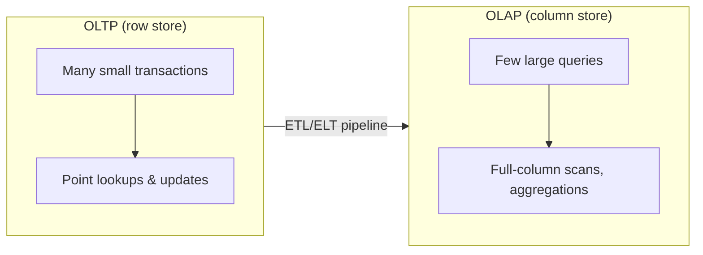

# OLTP vs OLAP

> Transactional systems and analytical systems want opposite things from a
> database engine. Confusing the two — running heavy analytics on the
> production OLTP database, or trying to do real-time single-row lookups on a
> columnar warehouse — is one of the most common architecture mistakes a data
> engineer is hired to fix.

## Choose a level

| Level | Guide | You are done when |
|---|---|---|
| Junior | [What each is optimized for](junior.md) | You can classify a workload as OLTP or OLAP from its query pattern. |
| Middle | [Row store vs. column store](middle.md) | You can explain why a column store answers `SUM(amount)` over 1B rows faster than a row store. |
| Senior | [Why one database rarely serves both well](senior.md) | You can explain HTAP and why "just run analytics on the production DB" degrades at scale. |
| Professional | [Designing the pipeline boundary](professional.md) | You can design the extraction/replication boundary between an OLTP source and an OLAP destination. |

## Practice rule

For any query you're about to run, ask: "does this touch one row, or scan
millions to aggregate?" The first belongs on an OLTP system; the second
belongs on an OLAP system. If you're not sure which system you're running it
against, check before you run it.

## Related

- [Relational Model](../../data-modeling/01-relational-model/README.md)
- [Kimball Dimensional Modeling](../../data-modeling/kimball-modeling/README.md)
- [Replication](../../scaling/16-replication/README.md)
