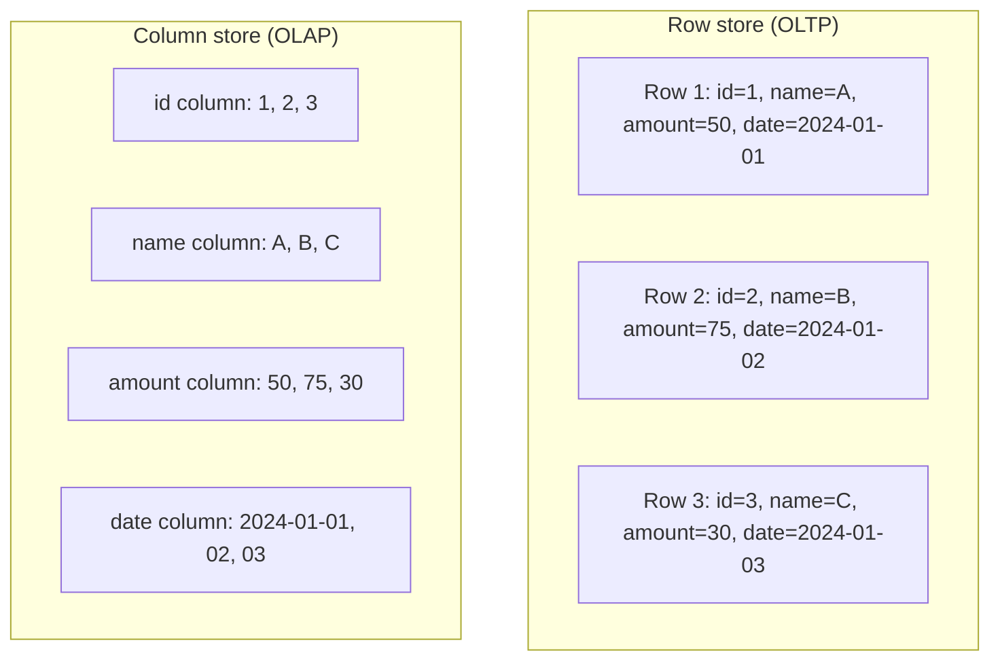

# OLTP vs OLAP — Middle

<!-- level-focus -->
At middle level, focus on this question:

> Why does physically storing data by column instead of by row make
> aggregation queries dramatically faster?

Prerequisite: [`junior.md`](junior.md).

---

## Row store vs. column store, on disk



A **row store** keeps all columns of one row physically adjacent on disk —
ideal for "fetch this entire order by ID," because one disk read gets every
column of that row. A **column store** keeps all values of one column
physically adjacent — ideal for `SUM(amount)`, because the engine reads only
the `amount` column's bytes, skipping `name`, `date`, and every other column
entirely.

## Why this matters at scale

```sql
SELECT SUM(amount) FROM orders;   -- 1 billion rows, 20 columns
```

- **Row store**: to read `amount` for every row, the engine still must read
  every row's full width off disk (or at least touch every row page),
  because columns are interleaved. You pay for all 20 columns' worth of I/O
  to sum 1.
- **Column store**: the engine reads only the `amount` column's contiguous
  bytes — roughly **1/20th the I/O** in this example — and column stores
  additionally compress extremely well (a column of repeated/similar values
  compresses far better than a mixed row), often cutting I/O further.

## Indexing philosophy differs too

| | OLTP | OLAP |
|---|---|---|
| Primary tool | B-tree indexes on frequently-looked-up columns (see [B+Tree](../../performance/14-indexing%20%26%20filtering/b+tree/README.md)) | Column compression + zone maps/min-max statistics per data block; often few or no traditional indexes |
| Write path | Optimized to be fast per-row (index maintenance on every insert) | Optimized for bulk loads (batch insert, then compress/sort once) |
| "Index" equivalent in OLAP | Partitioning/clustering keys, sort order within files (e.g. Parquet row groups) | — |

> 🎓 **Takeaway:** the physical layout decision (row-major vs. column-major)
> is the single biggest reason OLTP and OLAP systems can't both be "the best"
> general-purpose choice — it's a genuine trade-off baked into how bytes sit
> on disk, not just a configuration setting.

## Test yourself

1. Why does a column store's advantage shrink or disappear for a query like
   `SELECT * FROM orders WHERE id = 42` (fetch one full row)?
2. Why does column data typically compress better than row data? Give a
   concrete example using a `status` column with 3 possible values.
3. What does "zone map" mean, and how might it let a column store skip
   reading an entire block of data for a filtered query without decompressing
   it first?

Continue to [`senior.md`](senior.md).
