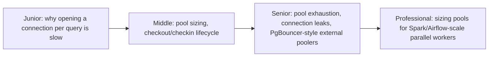
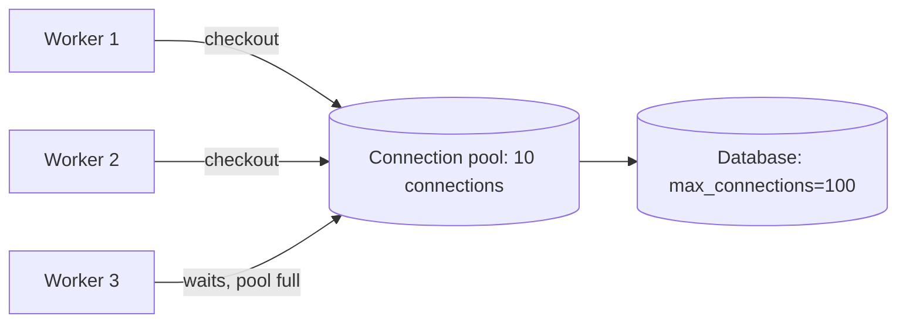

# Connection Pooling

> Opening a database connection is expensive — TCP handshake, TLS, auth,
> session setup. A connection pool reuses a small set of already-open
> connections instead of paying that cost per query, and its sizing decisions
> quietly control your pipeline's real concurrency limit.

## Choose a level

| Level | Guide | You are done when |
|---|---|---|
| Junior | [Why connections are expensive](junior.md) | You can explain what happens during connection setup and why reusing one is faster. |
| Middle | [Pool sizing and lifecycle](middle.md) | You can explain checkout/checkin and reason about a basic pool size formula. |
| Senior | [Exhaustion, leaks, and external poolers](senior.md) | You can diagnose a pool-exhaustion incident and explain what PgBouncer adds. |
| Professional | [Sizing for parallel pipeline workers](professional.md) | You can size connection pools across many parallel Spark/Airflow workers without exceeding the database's connection limit. |

## Practice rule

Before deploying any job that opens database connections, ask: "if every
worker/executor of this job runs at max parallelism simultaneously, how many
total connections does that add up to, and does the database's
`max_connections` limit survive it?" That arithmetic is the entire subject of
`professional.md`.

## Related

- [MVCC](../../transaction/10-mvcc/README.md)
- [Locking & Concurrency Control](../../transaction/09-locking-and-concurrency-control/README.md)
