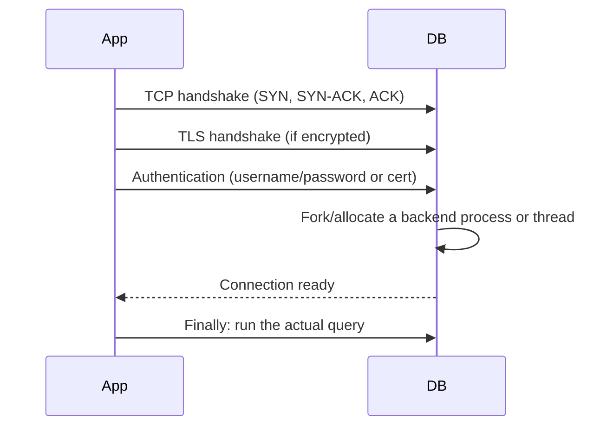

# Connection Pooling — Junior

<!-- level-focus -->
At junior level, focus on this question:

> What actually happens when you "open a database connection," and why is
> doing that once per query slow?

---

## What a connection setup actually costs



Every one of these steps takes real time — typically single-digit to
double-digit milliseconds for the network round trips alone, plus the
database's own per-connection memory allocation (Postgres, for example,
forks a full backend process per connection). If your application opens a
brand-new connection for every single query, you're paying this entire setup
cost **before** any actual work happens.

## The fix: keep connections open and reuse them

A **connection pool** opens a fixed number of connections once, at startup,
and hands them out to whoever needs to run a query — the caller "checks out"
a connection, uses it, and "checks it back in" instead of closing it.

```python
# Without a pool: setup cost paid on every request
def get_user(user_id):
    conn = psycopg2.connect(...)   # full handshake + auth, every time
    result = conn.execute(...)
    conn.close()
    return result

# With a pool: setup cost paid once, at pool creation
pool = ConnectionPool(min_size=5, max_size=20)

def get_user(user_id):
    with pool.connection() as conn:   # reuses an already-open connection
        return conn.execute(...)
```

> 🎓 **Takeaway:** a connection pool doesn't make any individual query
> faster — it eliminates the repeated setup cost of opening a new connection
> for every query, which matters enormously under any real request volume.

## Test yourself

1. List every step in the sequence diagram above that a pooled connection
   skips on its second and subsequent uses.
2. Why does Postgres forking a full OS process per connection make connection
   pooling *more* important for Postgres than for a database that uses
   lightweight threads per connection?
3. What would you expect to happen to request latency if you removed
   connection pooling from a busy web application?

Continue to [`middle.md`](middle.md).
