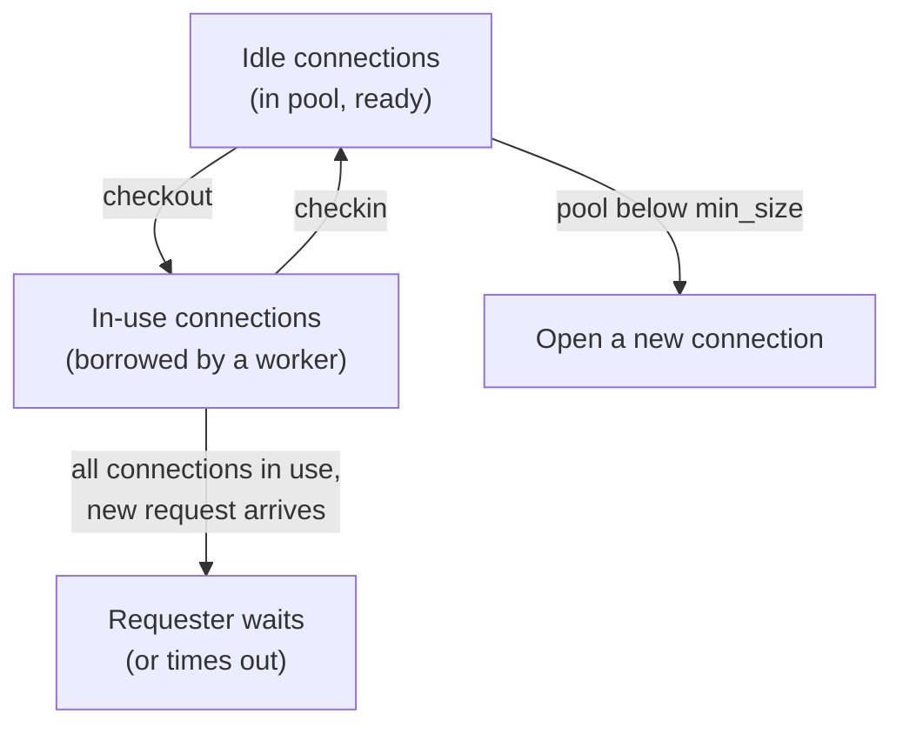
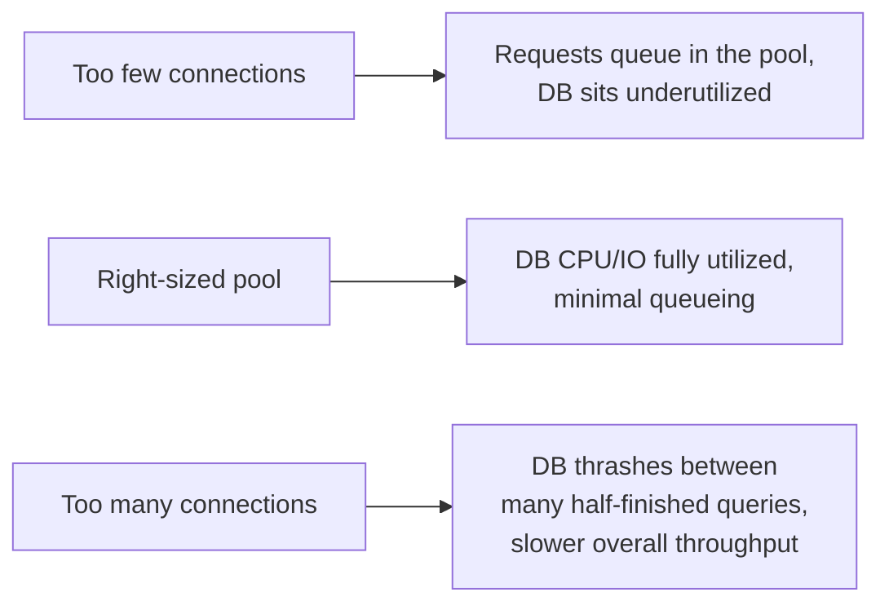

# Connection Pooling — Middle

<!-- level-focus -->
At middle level, focus on this question:

> How does a pool decide how many connections to keep, and what happens when
> every one of them is checked out?

Prerequisite: [`junior.md`](junior.md).

---

## Checkout / checkin lifecycle



| Setting | Meaning |
|---|---|
| `min_size` | Connections kept open even when idle, ready for immediate use. |
| `max_size` | Hard ceiling — the pool will never open more connections than this. |
| `checkout_timeout` | How long a caller waits for a free connection before giving up with an error. |
| `max_idle_time` | How long an idle connection sits before the pool closes it (to release resources during quiet periods). |

## A basic sizing formula

A commonly cited starting point (from PostgreSQL/HikariCP guidance):

```
pool_size ≈ (number of CPU cores on the DB server) × 2 + (number of disk spindles)
```

The intuition: beyond a certain number of concurrent active connections, the
database server's own CPU/IO becomes the bottleneck — adding more connections
just means more queries **queueing inside the database** instead of queueing
in your pool, which is strictly worse (the database now spends resources
context-switching between many partially-progressed queries instead of
finishing fewer, faster). **A bigger pool is not always a faster pool.**



## What happens at exhaustion

When every connection is checked out and a new request arrives, it **waits**
up to `checkout_timeout`, then fails with a pool-exhaustion error if none
frees up in time. This is a deliberate, visible failure mode — much better
than the alternative (an unbounded pool opening connections until the
database itself refuses new ones), but it means pool size directly caps your
application's real concurrency, regardless of how many application threads
or async tasks you spin up.

## Test yourself

1. Why would doubling `max_size` on a pool sometimes make average query
   latency *worse*, not better?
2. What's the practical difference between a request waiting on
   `checkout_timeout` versus the database itself rejecting a new connection
   because `max_connections` was reached?
3. If `min_size=5` and `max_size=20`, what happens to the 6th concurrent
   request when 5 connections are already checked out and busy?

Continue to [`senior.md`](senior.md).
