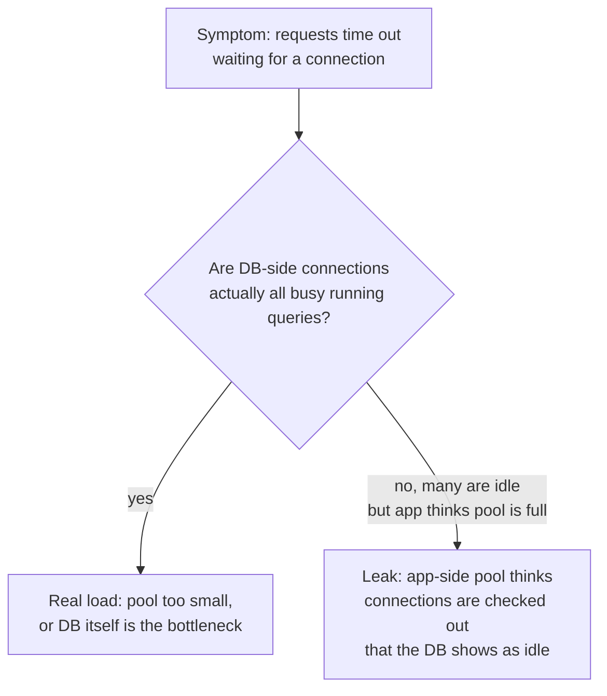
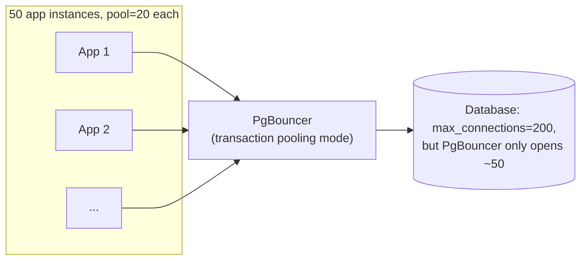

# Connection Pooling — Senior

<!-- level-focus -->
At senior level, focus on this question:

> How do you diagnose a pool-exhaustion incident, and what does an external
> pooler like PgBouncer add that an in-application pool can't?

Prerequisite: [`middle.md`](middle.md).

---

## Connection leaks: the most common exhaustion cause

A **leak** is a connection checked out and never checked back in — usually
because an exception path forgot to release it.

```python
# LEAK: if execute() raises, conn is never returned to the pool
conn = pool.checkout()
result = conn.execute(risky_query)   # raises an exception here
pool.checkin(conn)                    # never reached

# FIXED: context manager / try-finally guarantees checkin
with pool.connection() as conn:
    result = conn.execute(risky_query)   # checkin happens even on exception
```

A slow leak (one connection lost per hour due to a rare error path) can take
days to exhaust a pool, making it a classic "why did this start failing
today with no code change" incident — the leak had been accumulating for
weeks.

## Diagnosing pool exhaustion



```sql
-- Postgres: see what every connection is actually doing right now
SELECT pid, state, now() - query_start AS running_for, query
FROM pg_stat_activity
ORDER BY running_for DESC;
```

If the database shows connections sitting `idle` while your application's
pool metrics report "0 available," that mismatch is the leak signature —
the app lost track of connections it should have released.

## What an external pooler (PgBouncer) adds

An in-application connection pool is per-process — if you run 50 application
instances, each with a pool of 20, you can hit **1,000 total connections**
against a database whose `max_connections` might be 200. An external pooler
sits between all application instances and the database, multiplexing many
client-side "connections" onto a much smaller number of real database
connections.



**Transaction pooling mode** (PgBouncer's most aggressive, most common mode
for this problem) hands out a real database connection only for the duration
of one transaction, then returns it to the shared pool — so thousands of
client-side "connections" can share a much smaller number of real ones,
because most connections spend most of their time idle between queries, not
actively running one.

> 🎯 **Senior takeaway:** in-application pooling controls concurrency
> *within one process*. It does nothing to prevent the sum across all your
> processes/instances from exceeding the database's real limit — that's an
> external pooler's job, and it becomes necessary the moment you scale beyond
> a handful of application instances.

## Test yourself

1. Why would `pg_stat_activity` showing mostly `idle` connections while your
   app's pool metrics show "0 available" indicate a leak, not real load?
2. Why does transaction pooling mode let far more logical clients share far
   fewer real database connections than session-based pooling?
3. What breaks if an application relies on session-level features (e.g.
   temporary tables, session variables, `LISTEN/NOTIFY`) while running behind
   PgBouncer in transaction pooling mode?

Continue to [`professional.md`](professional.md) to size pools for parallel
pipeline workloads like Spark or Airflow.
