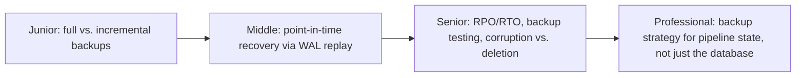

# Backup & Recovery

> A backup you've never restored is a hypothesis, not a backup. This topic is
> about the mechanisms (full/incremental/WAL-based) and the two numbers that
> actually matter when something breaks: how much data you can lose (RPO) and
> how long you can be down (RTO).

## Choose a level

| Level | Guide | You are done when |
|---|---|---|
| Junior | [Full vs. incremental backups](junior.md) | You can explain the storage/restore-speed trade-off between full and incremental backups. |
| Middle | [Point-in-time recovery](middle.md) | You can explain how a base backup plus WAL archive lets you restore to any specific second. |
| Senior | [RPO, RTO, and testing backups](senior.md) | You can define RPO/RTO for a real system and explain why an untested backup is not a safety net. |
| Professional | [Backing up pipeline state, not just the DB](professional.md) | You can design a recovery plan covering Kafka offsets, checkpoint state, and orchestrator metadata — not just the database. |

## Practice rule

Pick a backup your team currently relies on and ask: "when was the last time
someone actually restored from this, end to end, and measured how long it
took?" If the honest answer is "never," you don't have a tested recovery
plan — you have an unverified assumption.

## Related

- [MVCC](../../transaction/mvcc/README.md)
- [Replication](../../scaling/replication/README.md)
- [Transactions & ACID](../../transaction/transactions-and-acid/README.md)
