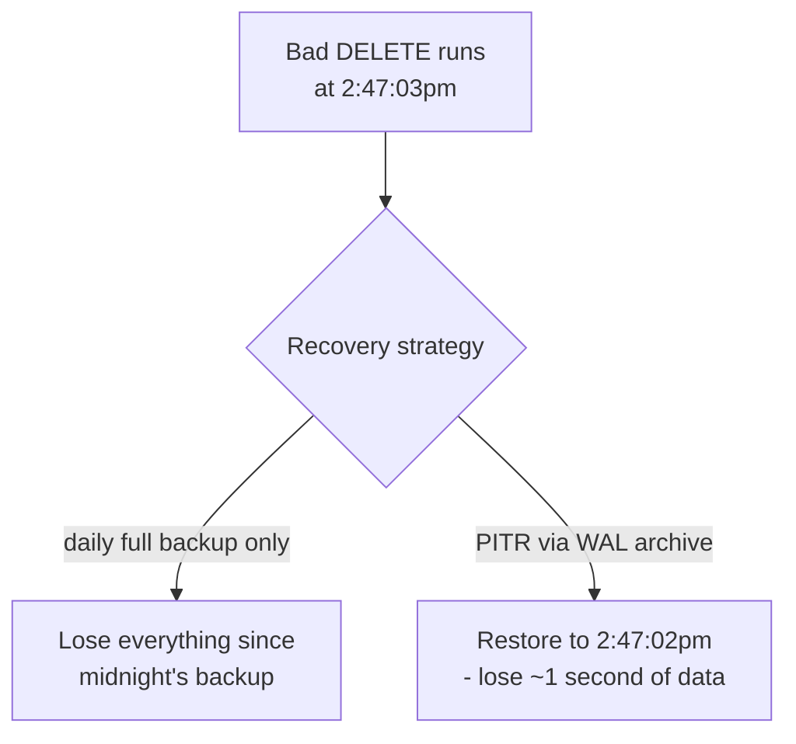

# Backup & Recovery — Middle

<!-- level-focus -->
At middle level, focus on this question:

> How does a database let you restore to an arbitrary second in the past,
> not just to the moment of your last backup?

Prerequisite: [`junior.md`](junior.md).

---

## Point-in-time recovery (PITR)

Recall the write-ahead log (WAL) from
[Transactions & ACID — middle](../../transaction/07-transactions-and-acid/middle.md):
every committed change is durably logged, in order, before being applied to
data pages. If you keep a **base backup** (a full snapshot) plus the
**continuous WAL archive** since that backup, you can replay the log forward
from the base backup to **any specific point in time** — not just to the
moment the backup was taken.


```sql
-- Conceptual Postgres PITR recovery configuration
restore_command = 'cp /wal_archive/%f %p'
recovery_target_time = '2024-01-17 14:47:03'
```

The database restores the base backup, then replays every WAL record up to
(but not including) the target time — reconstructing the exact state of the
database at that precise second, including every committed transaction up to
that point and none after it.

## Why this matters more than daily full backups alone

Without WAL-based PITR, your only restore points are whenever you happened to
take a backup — if a bad `DELETE` runs at 2:47pm and your last full backup
was midnight, you lose everything from midnight to 2:47pm on restore. With
PITR, you can restore to **2:47:02pm**, one second before the bad delete,
losing almost nothing.



## Test yourself

1. Why can't you achieve point-in-time recovery with full/incremental
   snapshot backups alone, no matter how frequently you take them?
2. What has to be true about your WAL archive's completeness for PITR to
   `2:47:03pm` to actually work?
3. If you take a base backup once a week and archive WAL continuously, how
   much WAL do you need to retain to guarantee PITR to any point in the past
   month?

Continue to [`senior.md`](senior.md).
