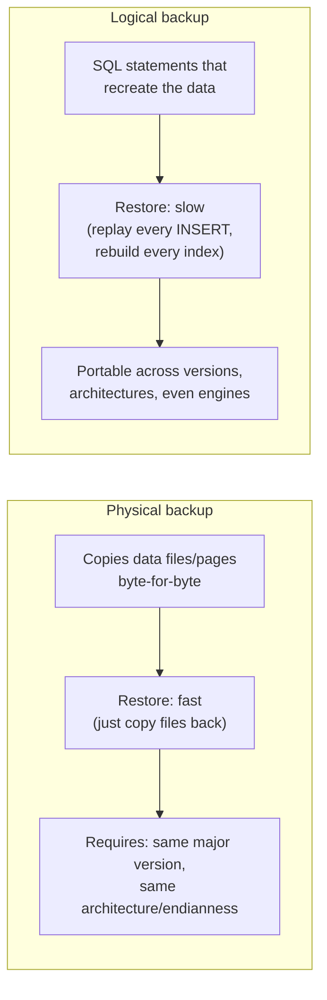
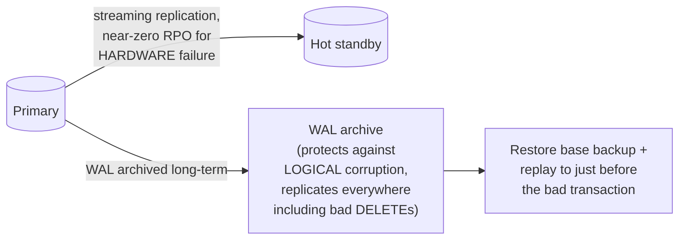

# Backup & Recovery — Professional

<!-- level-focus -->
At professional level, focus on this question:

> What are the actual internal mechanisms behind physical vs. logical
> backups, streaming replication's role in backup strategy, and how do you
> reason about recovery at a systems level when a single-node restore isn't
> enough?

Prerequisite: [`senior.md`](senior.md).

---

## Physical vs. logical backups: fundamentally different failure/restore properties

A **physical backup** (Postgres's `pg_basebackup`, a filesystem/block-level
snapshot, MySQL's `xtrabackup`) copies the actual data files/pages byte-for-byte.
A **logical backup** (`pg_dump`, `mysqldump`) reconstructs the data via SQL
statements (`INSERT`/`COPY`) that recreate the same logical content, but not
the same physical layout.



The staff-level trade-off: physical backups restore fast but are tied to
the exact same major version and architecture (you cannot restore a
Postgres 12 physical backup into a Postgres 16 cluster) — logical backups
are portable across versions but pay a real cost at restore time
proportional to data volume, because every index has to be rebuilt from
scratch and every row re-inserted through the normal write path (WAL
generation, MVCC tuple creation, the works) rather than just materializing
pre-built pages. **A large production database's disaster-recovery plan
almost always needs physical backups/PITR as the primary mechanism and
logical backups as a supplementary tool for version-portable exports or
selective table recovery**, not the reverse.

## Streaming replication is not a backup, but changes the whole calculus

A **hot standby** replica receiving continuous WAL via streaming
replication provides near-zero RPO for hardware failure (promote the
replica, minimal data loss) but shares the exact same **logical corruption
exposure** as the primary — a bad `DELETE`/migration replicates to the
standby within seconds, meaning a standby alone does not substitute for
point-in-time-recoverable backups. The professional-level architecture
combines both: streaming replication for fast failover on infrastructure
failure, plus a WAL archive (the same WAL stream, additionally retained
long-term) for PITR against logical corruption that a live standby cannot
protect against.



## Consistent cross-shard/cross-service snapshots: the real distributed-systems problem

For a sharded database or a system spanning multiple independently-backed-up
components, taking backups of each shard/component at "the same wall-clock
time" does **not** produce a mutually consistent snapshot, because wall
clocks drift and each backup's actual start/completion time varies. Systems
requiring true cross-shard consistent snapshots implement this via a
**globally coordinated snapshot protocol** — analogous to the
Chandy-Lamport distributed snapshot algorithm: each shard's backup process
records a consistent local cut coordinated via a shared logical marker
(a specific committed LSN/transaction ID broadcast to all shards, or a
globally synchronized timestamp in systems like Google Spanner using
TrueTime), rather than relying on wall-clock coincidence.

## Production checklist (staff-level)

1. **Default to physical backups/PITR as the primary DR mechanism for any
   database above a modest size**, reserving logical backups for
   version-portable exports, cross-engine migration, or selective
   table-level recovery — restore-time cost, not backup-time cost, should
   drive this decision.
2. **Never treat a hot standby as a substitute for point-in-time-recoverable
   backups** — architect both, explicitly, because they protect against
   different failure classes (infrastructure vs. logical corruption).
3. **For any sharded or multi-component system, use a coordinated snapshot
   marker (a shared logical checkpoint, not wall-clock timing) to define
   "the same point in time" across independently-backed-up components** —
   this is a distributed-systems design decision, not a scheduling detail.
4. **Test restore procedures across major-version boundaries explicitly**
   if your DR plan ever involves restoring into a different version than
   the source — physical backup incompatibility across versions is a common
   discovery made during an actual incident rather than a drill.
5. **In a DR architecture review, explicitly diagram which failure class
   each mechanism protects against** (streaming replication → infrastructure
   failure; WAL-archived PITR → logical corruption; logical export →
   version/engine migration) — a single unified "we have backups" answer
   hides which specific failure modes are actually covered.

## Cheat Sheet

```text
+------------------------------------------------------------------+
|              BACKUP & RECOVERY — INTERNALS & SCALE                  |
+------------------------------------------------------------------+
| Physical backup: byte-for-byte data files, fast restore, tied to      |
|   exact major version/architecture                                    |
| Logical backup: SQL that recreates data, slow restore (rebuilds        |
|   every index, replays every INSERT through normal write path),       |
|   but version/engine-portable                                         |
+------------------------------------------------------------------+
| Streaming replication (hot standby) protects against HARDWARE          |
| failure only - logical corruption (bad DELETE/migration) replicates    |
| to the standby too. WAL-archived PITR is the ONLY defense against     |
| logical corruption - architect BOTH, they cover different failures    |
+------------------------------------------------------------------+
| Sharded/multi-component consistent snapshots need a COORDINATED        |
| logical marker (shared LSN/txn-id, or TrueTime-style global clock),   |
| not wall-clock-coincident backup scheduling (Chandy-Lamport-style      |
| distributed snapshot reasoning)                                        |
+------------------------------------------------------------------+
```

## Test yourself

1. Why can't you restore a Postgres 12 physical backup directly into a
   Postgres 16 server, while a `pg_dump` logical backup from the same
   source restores fine there?
2. A team relies solely on a hot standby for disaster recovery. A bad
   migration corrupts data on the primary. Walk through exactly what
   happens to the standby, and why it doesn't help here.
3. Design a coordinated-snapshot mechanism for backing up 20 independently
   deployed database shards such that the combined backup represents one
   consistent point in time, without relying on synchronized wall clocks.

## Further Reading

- PostgreSQL documentation — "Continuous Archiving and Point-in-Time
  Recovery," "File System Level Backup" vs. "SQL Dump."
- Chandy & Lamport — "Distributed Snapshots: Determining Global States of
  Distributed Systems" (1985 — the formal basis for coordinated multi-node
  snapshot consistency).
- Corbett et al. — "Spanner: Google's Globally-Distributed Database"
  (TrueTime and globally consistent snapshots in production).
- See also: [MVCC — professional](../../transaction/mvcc/professional.md),
  [Replication — professional](../../scaling/replication/professional.md).
