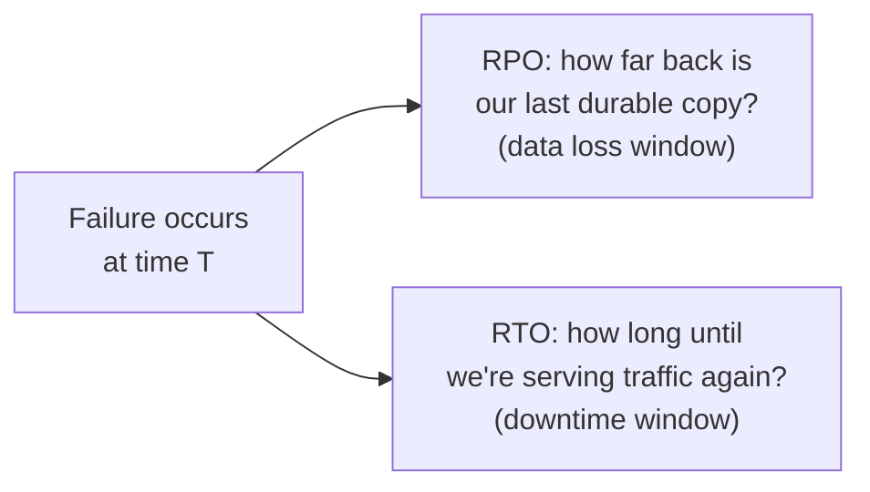
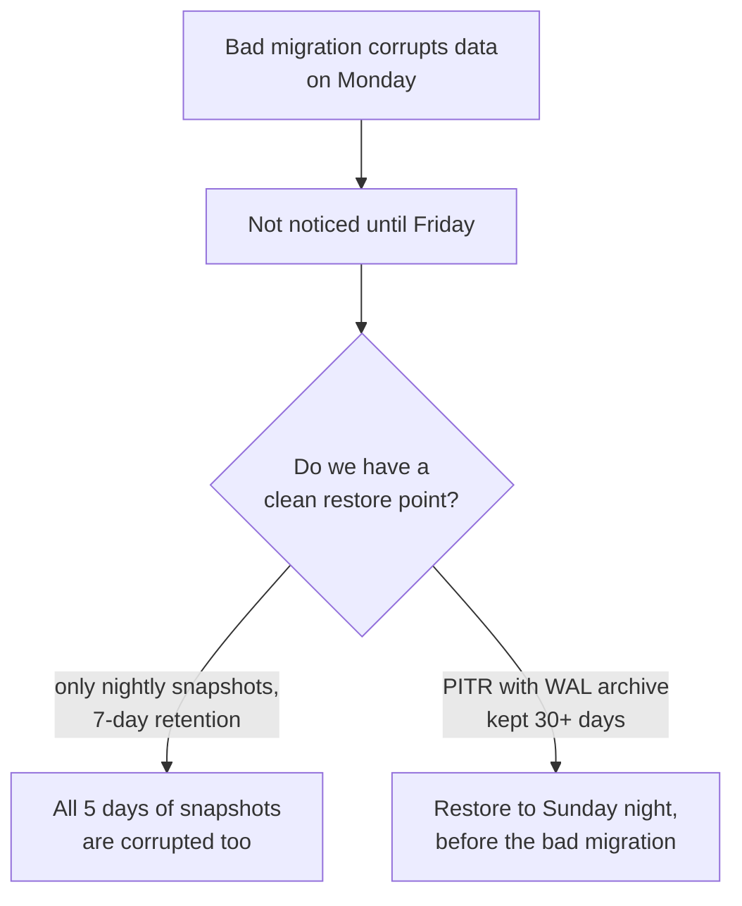

# Backup & Recovery — Senior

<!-- level-focus -->
At senior level, focus on this question:

> What are RPO and RTO, and why is an untested backup functionally the same
> as no backup?

Prerequisite: [`middle.md`](middle.md).

---

## RPO and RTO

| Term | Question it answers | Driven by |
|---|---|---|
| **RPO** (Recovery Point Objective) | "How much data can we afford to lose?" | Backup/WAL-archive frequency — the gap between your last durable copy and the failure. |
| **RTO** (Recovery Time Objective) | "How long can we afford to be down?" | Restore mechanics — how fast you can load a base backup, replay WAL, warm caches, and cut traffic back over. |

These are **business decisions dressed as engineering numbers** — a
financial ledger might need an RPO near zero (synchronous replication, WAL
shipped continuously) while an analytics cache might tolerate an RPO of
hours. Every backup/replication strategy should trace back to an explicit
RPO/RTO target, not a vague "we back up nightly."

## Corruption vs. deletion: your backup must survive both

A backup strategy that only protects against **hardware failure** (disk
dies, restore the latest backup) doesn't automatically protect against
**logical corruption** (a bad migration silently corrupts data, or a bug
deletes rows) — if corruption isn't noticed for days, and your only backups
are recent snapshots, **every backup you have might already contain the
corruption.**

This is why retention window matters as much as backup frequency: **your
retention needs to comfortably exceed your realistic detection time for
logical corruption**, not just cover hardware-failure recovery.

## Untested backups are a hypothesis

A backup that has never been restored has an unknown number of ways it could
fail: a misconfigured backup job that's been silently writing empty files for
months, a WAL archive with a gap nobody noticed, credentials that expired,
storage that quietly stopped being written to. **The only way to know a
backup works is to actually restore from it and verify the result.**

> 🎯 **Senior takeaway:** run scheduled, automated restore drills — not
> manual, once-a-year fire drills, but a job that regularly restores the
> latest backup to a scratch environment and runs integrity checks. Treat "we
> have backups" and "we have proven we can restore from our backups within
> our RTO" as two entirely different claims.

## Test yourself

1. A team backs up nightly with 7-day retention. A subtle data-corrupting bug
   goes unnoticed for 10 days. What went wrong with their strategy, and what
   would you change?
2. Why does "we have backups" not answer the question "what's our RTO"? What
   additional information do you need?
3. Design a minimal automated restore-drill job: what would it do, how often
   would it run, and what would it alert on?

Continue to [`professional.md`](professional.md) to extend backup/recovery
thinking beyond the database to the rest of a pipeline's state.
