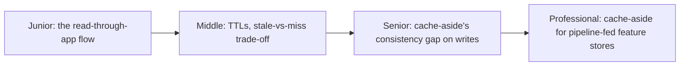
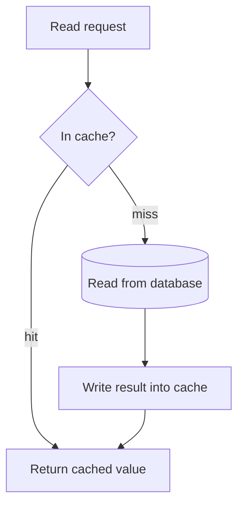

# Cache-Aside (Lazy Loading)

> The application checks the cache first; on a miss, it reads the database
> itself and populates the cache. The most common caching pattern precisely
> because the cache can be added, removed, or cleared without ever touching
> write logic.

## Choose a level

| Level | Guide | You are done when |
|---|---|---|
| Junior | [The read flow](junior.md) | You can trace a cache hit and a cache miss through the diagram above. |
| Middle | [TTLs and staleness](middle.md) | You can explain the trade-off between a short and long TTL. |
| Senior | [The write-side consistency gap](senior.md) | You can explain why cache-aside alone doesn't keep the cache in sync with writes. |
| Professional | [Cache-aside for feature stores](professional.md) | You can design a cache-aside layer in front of a low-latency feature-serving pipeline. |

## Practice rule

Ask of any cache-aside deployment: "if the database changes right now, how
does the stale cached value ever get corrected — and how long can that take?"
If the answer is "it doesn't, until TTL expiry," write that number down as
your effective staleness bound.

## Related

- [Write-Through](../02-write-through/README.md)
- [Cache Invalidation](../07-cache-invalidation/README.md)
- [Types of Caching](../06-types-of-caching/README.md)
