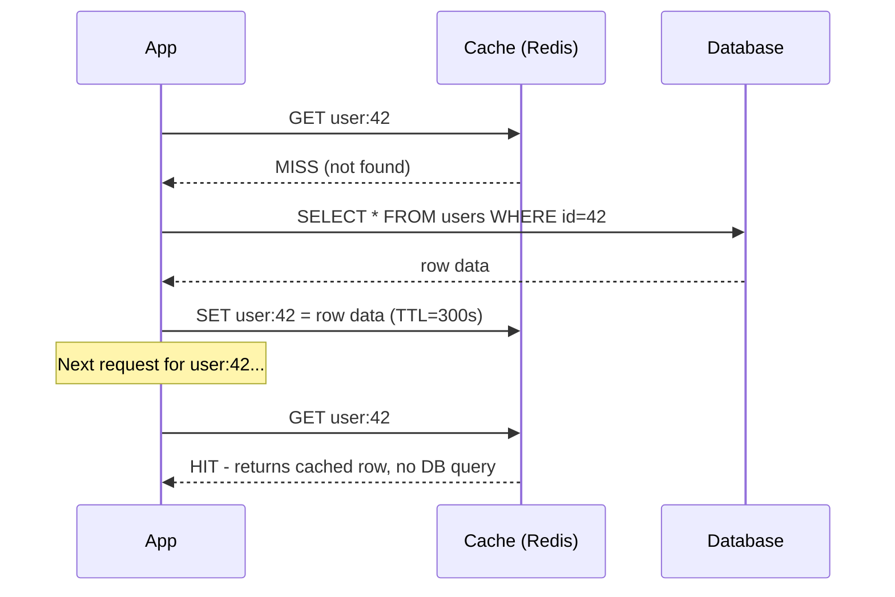

# Cache-Aside — Junior

<!-- level-focus -->
At junior level, focus on this question:

> Who is responsible for populating the cache — the cache itself, or the
> application?

---

## The flow, step by step



In **cache-aside** (also called lazy loading), the cache is a passive
key-value store with no knowledge of the database. The **application** is
responsible for: checking the cache first, falling back to the database on a
miss, and writing the result back into the cache. This is why it's called
"aside" — the cache sits beside the application's read path, not inline with
the database automatically.

```python
def get_user(user_id):
    cached = cache.get(f"user:{user_id}")
    if cached is not None:
        return cached                      # cache hit
    row = db.query("SELECT * FROM users WHERE id = %s", user_id)
    cache.set(f"user:{user_id}", row, ttl=300)   # populate on miss
    return row
```

> 🎓 **Takeaway:** cache-aside puts the application in charge of both reading
> and populating the cache. This is simple and flexible — you can deploy it
> in front of any existing database with zero changes to the database itself
> — but it means the cache only ever gets fresh data for keys someone has
> actually requested (a "cold" cache after a restart has zero hit rate until
> requests start repopulating it).

## Test yourself

1. What does the cache return for a key that's never been requested before,
   even if that row exists in the database?
2. Why does a freshly-restarted (empty) cache cause a temporary spike in
   database load?
3. In the code example, what happens if two requests for the same missing
   `user_id` arrive at nearly the same time?

Continue to [`middle.md`](middle.md).
