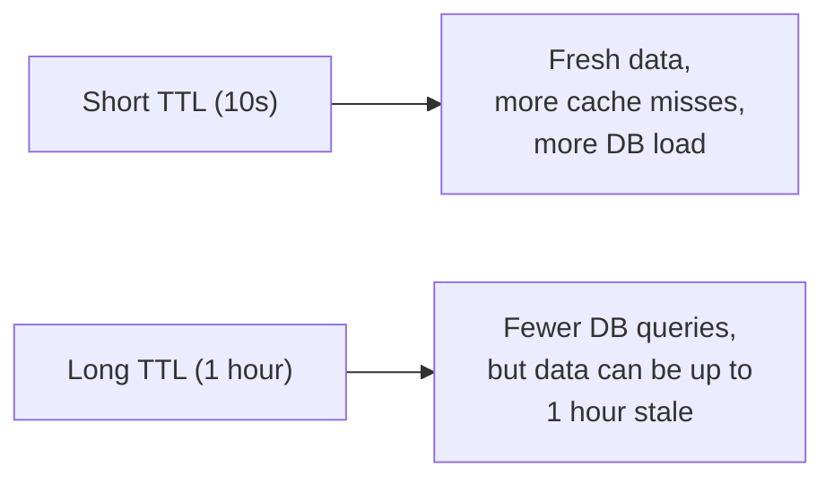

# Cache-Aside — Middle

<!-- level-focus -->
At middle level, focus on this question:

> How does the TTL you choose trade off staleness against database load?

Prerequisite: [`junior.md`](junior.md).

---

## TTL controls the staleness/load trade-off



Every cached entry expires after its TTL, forcing the next request for that
key to miss and re-fetch from the database — this is the *only* mechanism
that corrects staleness in plain cache-aside (no invalidation), so the TTL is
a direct, tunable bound on "how wrong can this cached value be, at worst."

| TTL choice | Good for |
|---|---|
| Seconds | Rapidly-changing data (stock prices, live counters) where staleness is expensive |
| Minutes to hours | Data that changes occasionally (user profile, product catalog) |
| Very long / no expiry | Reference data that almost never changes (country codes, static config) — pair with explicit invalidation (`07-cache-invalidation/`) instead of relying on TTL alone |

## Miss vs. stale: two different costs

A **cache miss** costs one database round trip — bounded, predictable.
**Serving stale data** (a value that's technically still cached but no longer
matches the database) costs something much harder to bound: a wrong answer
served to a user or downstream system, for up to the TTL's full duration.

```python
def get_user(user_id):
    cached = cache.get(f"user:{user_id}")
    if cached is not None:
        return cached   # could be up to TTL seconds stale - is that OK here?
    ...
```

> 🎓 **Takeaway:** choosing a TTL is choosing how much staleness your
> specific use case can tolerate, in exchange for how much database load
> you're willing to accept. There's no universal "correct" TTL — it's a
> per-key-type business decision.

## Test yourself

1. Why is a 1-hour TTL potentially dangerous for a "current inventory count"
   cache key, but perfectly fine for a "country list" cache key?
2. If database load spikes right after a deploy, and you suspect it's from
   cache misses, what would you check first?
3. Design two different TTLs for two different fields on the same `user`
   object — which field gets the shorter TTL, and why?

Continue to [`senior.md`](senior.md).
