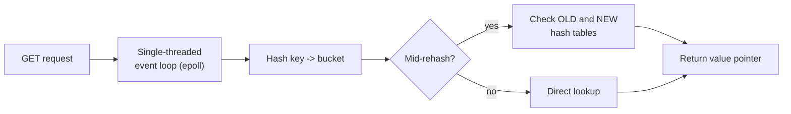

# Cache-Aside — Professional

<!-- level-focus -->
At professional level, focus on this question:

> What does Redis/Memcached actually do internally to serve a GET in
> microseconds, and what breaks first when a cache-aside deployment scales
> to millions of keys and requests per second?

Prerequisite: [`senior.md`](senior.md).

---

## What "cache hit in under a millisecond" actually is, mechanically

Redis is fundamentally a **single-threaded event loop** (per core, for the
data-serving path) built on `epoll`/`kqueue`, storing all data in-process
memory as native structures (a hash table for the keyspace itself,
resolving to per-type encodings: `ziplist`/`listpack` for small
lists/hashes, `intset` for small integer sets, a raw hash table for larger
ones). A `GET` is: hash the key, walk the bucket's chain (Redis's hash table
uses chaining plus **incremental rehashing** — two hash tables live
side-by-side during a resize, with lookups checking both and a background
process migrating buckets gradually so no single operation pays the full
resize cost), and return a pointer to the value — no disk I/O, no lock
contention with other cores, entirely CPU-cache-and-RAM-bound. This
single-threaded model is *why* Redis avoids the internal lock-manager/latch
contention problems that plague heavily concurrent multi-threaded engines
(see the Locking & Concurrency Control professional page) — there is
structurally nothing to contend over within one instance.



## The real ceiling: it's not CPU, it's network syscalls and memory fragmentation

At high QPS, a single Redis instance's throughput ceiling is typically the
**syscall overhead of the event loop** (each `read()`/`write()` on a socket,
even with `epoll` batching) long before CPU computation on the data
structures becomes limiting — this is why Redis's own roadmap added
**I/O threading** (multiple threads handling socket read/write/protocol
parsing, while the actual command execution against the dataset stays
single-threaded) specifically to relieve this syscall bottleneck without
reintroducing data-structure lock contention.

Separately, **memory fragmentation** is a distinct, often-overlooked
production failure mode: Redis's allocator (`jemalloc` by default) can end
up with `used_memory_rss` significantly exceeding `used_memory` (the
logical data size) after sustained churn of variable-sized keys being
created and deleted — `mem_fragmentation_ratio > 1.5` is a real operational
signal that the instance is at risk of hitting its memory limit and
triggering eviction/OOM well before the logical dataset size would suggest,
and requires either `MEMORY PURGE` (in newer Redis with `jemalloc`'s active
defragmentation) or a planned restart/failover to reclaim it.

## Cluster mode: hash slots and the cross-slot operation constraint

Redis Cluster shards the keyspace into **16,384 fixed hash slots**
(`CRC16(key) mod 16384`), each slot owned by exactly one primary node (plus
replicas). This fixed slot count (not tied to node count) is a deliberate
design choice: adding/removing nodes means **migrating whole slots**
between nodes, a well-bounded, resumable operation, rather than
recomputing a hash function's range boundaries across the whole keyspace.
The direct professional-level consequence for cache-aside at scale: any
multi-key operation (`MGET`, a Lua script touching multiple keys) must have
all keys hash to the **same slot**, or Redis rejects it — production systems
needing multi-key atomicity use **hash tags** (`{user:42}:profile` and
`{user:42}:settings` both hash on `user:42`, forcing them into the same
slot) specifically to work around this constraint, and getting this wrong
is one of the most common Redis Cluster migration bugs.

## Production checklist (staff-level)

1. **Monitor `mem_fragmentation_ratio` as a first-class metric**, not just
   `used_memory` against `maxmemory` — fragmentation-driven OOM/eviction is
   a distinct failure mode from genuine dataset growth and has a different
   remediation.
2. **Design multi-key access patterns around hash tags from day one** if
   you plan to run Redis Cluster — retrofitting hash tags into a keyspace
   already in production requires a data migration, not a config change.
3. **Profile whether your bottleneck is CPU (data structure operations) or
   syscall/network overhead** before choosing to scale vertically (bigger
   instance) vs. horizontally (more shards) — I/O threading configuration
   changes the calculus for the former, cluster sharding addresses the
   latter differently.
4. **For a `MULTI`/`EXEC` transaction or Lua script spanning multiple keys,
   verify slot co-location explicitly** in code review, not just in a
   single-node dev environment where the constraint is invisible.
5. **Treat single-threaded command execution as an operational constraint
   on slow commands**: a single `KEYS *` or an unbounded `SMEMBERS` on a
   huge set blocks the entire event loop for every other client on that
   node/thread for its full duration — audit for these specifically,
   they're a self-inflicted denial-of-service, not a capacity problem.

## Cheat Sheet

```text
+------------------------------------------------------------------+
|                CACHE-ASIDE — INTERNALS & SCALE                      |
+------------------------------------------------------------------+
| Redis: single-threaded event loop (epoll), in-memory hash table       |
| with incremental rehashing (old+new tables checked during resize) -    |
| no internal lock contention, entirely RAM/CPU-cache bound              |
+------------------------------------------------------------------+
| Real ceiling: often syscall/network overhead (read/write per          |
| connection), not data-structure CPU cost -> I/O threading addresses    |
| this without breaking single-threaded command execution                |
| Memory fragmentation (jemalloc, RSS vs. used_memory) is a DISTINCT      |
| failure mode from logical dataset growth - monitor separately          |
+------------------------------------------------------------------+
| Redis Cluster: 16,384 FIXED hash slots, one primary per slot.          |
| Multi-key ops MUST hash to the same slot -> use HASH TAGS               |
| ({user:42}:...) deliberately, or multi-key transactions fail            |
+------------------------------------------------------------------+
| Single-threaded execution = one slow command (KEYS *, huge SMEMBERS)   |
| blocks EVERY client on that node for its full duration - audit for     |
| these as a self-inflicted DoS risk                                     |
+------------------------------------------------------------------+
```

## Test yourself

1. Why does Redis's single-threaded design avoid the lock-manager
   contention problems that afflict multi-threaded database engines at
   high concurrency, and what does it trade away to get this property?
2. `used_memory` reports 4GB but `used_memory_rss` reports 9GB on a Redis
   instance approaching its `maxmemory` limit. What's happening, and what
   would you do about it?
3. Design a key-naming scheme using hash tags so that a Lua script can
   atomically read and update both a user's profile and their session data
   on Redis Cluster.

## Further Reading

- Redis documentation — "Redis Cluster Specification" (hash slots, resharding,
  hash tags) and "Memory Optimization" (fragmentation, `jemalloc` internals).
- Salvatore Sanfilippo (antirez) — engineering blog posts on Redis's
  single-threaded design rationale and I/O threading additions.
- See also: [Cache Stampede & Hot Keys — professional](../08-cache-stampede-and-hot-keys/professional.md).
