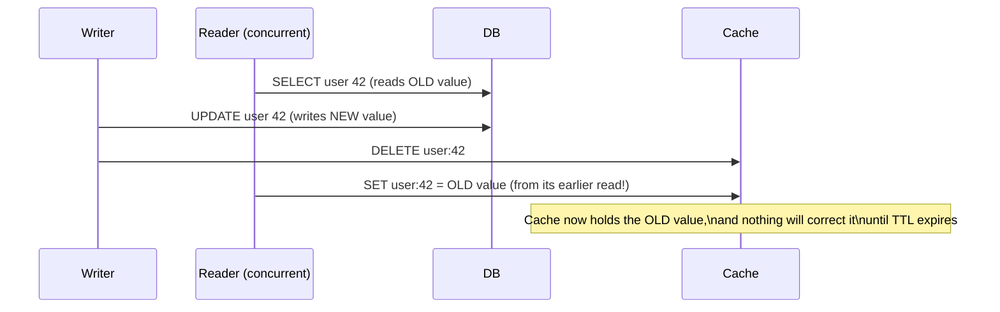

# Cache-Aside — Senior

<!-- level-focus -->
At senior level, focus on this question:

> Why doesn't cache-aside automatically keep the cache in sync when the
> underlying data changes, and what race condition can leave it permanently
> wrong?

Prerequisite: [`middle.md`](middle.md).

---

## Cache-aside says nothing about writes

`junior.md` and `middle.md` only describe the **read** path. Nothing in
cache-aside updates the cache when a write happens — a common companion
pattern is: on write, delete the cache key (rather than update it), so the
next read repopulates it from the now-current database.

```python
def update_user(user_id, new_email):
    db.execute("UPDATE users SET email = %s WHERE id = %s", new_email, user_id)
    cache.delete(f"user:{user_id}")   # force next read to refetch
```

## The race condition: a stale write can win



The reader's database read happened **before** the write, but its cache
write happens **after** the invalidation — so it repopulates the cache with
stale data, and that stale value now sits in the cache for the full TTL with
no further trigger to correct it. This is a genuine, if narrow, race window
inherent to cache-aside without additional coordination.

**Mitigations:**

- **Short TTLs** bound how long this stale window can last, even in the worst
  case — this is why "always set a TTL, even a long one" is a best practice
  even for rarely-changing data.
- **Versioned writes**: only allow a cache-set if the read behind it started
  after the last known write (requires tracking a version/timestamp),
  eliminating the race at the cost of complexity.
- **Write-through/write-behind patterns** (see
  [Write-Through](../02-write-through/README.md)) avoid this class of race
  entirely by making the write path itself responsible for cache
  consistency, rather than reconstructing it lazily on the next read.

> 🎯 **Senior takeaway:** cache-aside's simplicity comes from decoupling
> reads and writes — which is exactly what creates this race. Always pair
> cache-aside with a TTL as a backstop, even if you also invalidate on write;
> never assume delete-on-write alone guarantees the cache can't go stale.

## Test yourself

1. Walk through the race condition above with your own timestamps — what has
   to be true about the reader's and writer's relative timing for it to
   occur?
2. Why does setting a TTL, even a generous one, meaningfully bound the damage
   from this race, even though it doesn't prevent the race itself?
3. Would using `SET user:42 = value IF cache_version < my_read_version`
   (a conditional set) prevent this race? Explain why or why not.

Continue to [`professional.md`](professional.md) to design cache-aside for a
low-latency feature-serving pipeline.
