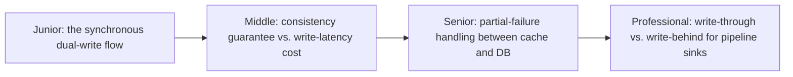
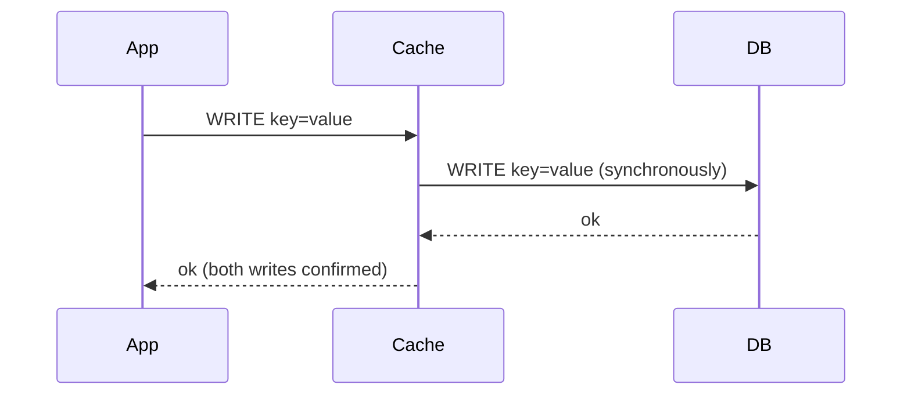

# Write-Through Caching

> Every write goes to the cache and the database together, synchronously, so
> the cache is never stale for data written this way — at the cost of every
> write paying two round trips instead of one.

## Choose a level

| Level | Guide | You are done when |
|---|---|---|
| Junior | [The dual-write flow](junior.md) | You can explain why write-through never serves stale data for keys it manages. |
| Middle | [The latency cost](middle.md) | You can compare write-through's write latency against cache-aside's. |
| Senior | [Partial failure](senior.md) | You can design what happens if the cache write succeeds but the database write fails, or vice versa. |
| Professional | [Write-through vs. write-behind for pipelines](professional.md) | You can decide between them for a pipeline sink that must stay consistent under load. |

## Practice rule

For any write-through deployment, ask: "if the process crashes between the
cache write and the database write, what state is the system left in, and
does anything detect or correct it?" That's `senior.md`'s entire subject.

## Related

- [Cache-Aside](../01-cache-aside/README.md)
- [Write-Behind](../03-write-behind/README.md)
- [Transactions & ACID](../../../transaction/07-transactions-and-acid/README.md)
