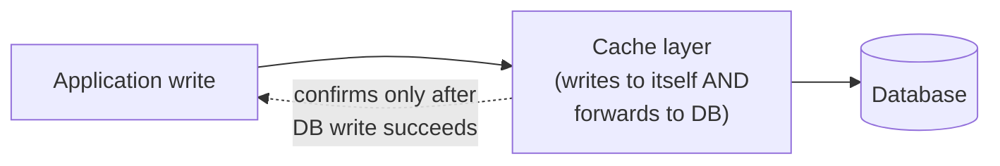

# Write-Through — Junior

<!-- level-focus -->
At junior level, focus on this question:

> Why does a write-through cache never serve stale data for keys it manages,
> unlike cache-aside?

---

## The flow



```python
def update_user_email(user_id, new_email):
    # The caching layer handles both writes as one logical operation
    cache_and_db.write(f"user:{user_id}", {"email": new_email})
    # internally: writes to cache, then synchronously writes to DB,
    # and only returns success once BOTH have completed
```

Compare this to cache-aside (`../01-cache-aside/junior.md`), where a write
only touches the database, and the cache either gets deleted (to be
repopulated later) or is left alone entirely, unaware anything changed. In
write-through, the cache is updated **at write time, synchronously, with the
new value** — so the very next read hits a cache that's already correct, with
no miss and no wait for TTL expiry.

> 🎓 **Takeaway:** write-through trades write latency (every write now waits
> for two systems instead of one) for read-side freshness guarantees (a
> successful write means the cache is immediately, provably correct for that
> key — no staleness window at all).

## Test yourself

1. Why does write-through never need a TTL to "correct" the cache the way
   cache-aside does — what makes that unnecessary here?
2. What happens to write latency compared to writing directly to the
   database with no caching layer at all?
3. If a read happens for a key that was never written through this path
   (e.g. seeded directly into the database), does write-through's guarantee
   still hold for that key?

Continue to [`middle.md`](middle.md).
