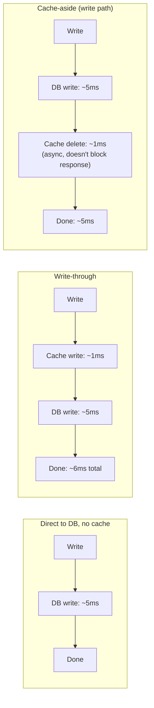

# Write-Through — Middle

<!-- level-focus -->
At middle level, focus on this question:

> What's the actual latency cost of write-through, and when is that cost
> worth paying?

Prerequisite: [`junior.md`](junior.md).

---

## Latency comparison

Write-through adds the cache write to the **critical path** of every write —
your write latency is now roughly the sum of both, not just the database's.
Cache-aside's write path (per `senior.md` of that topic) typically just
deletes the cache key, which can even be fired asynchronously without
blocking the response, keeping write latency closer to the database's alone.

## When the trade is worth it

| Signal | Favor |
|---|---|
| Read-heavy workload, reads vastly outnumber writes | Write-through — pay a small write-latency tax once, get every subsequent read guaranteed fresh with no miss |
| Write-heavy workload | Cache-aside — don't pay double-write cost on every single write when writes dominate |
| Strong freshness requirement immediately after write | Write-through — no staleness window at all, unlike cache-aside's TTL-bounded window |
| Cache is optional/best-effort (can be flushed and rebuilt) | Cache-aside — simpler, and the cache being briefly cold is an acceptable cost |

> 🎓 **Takeaway:** write-through is the right choice specifically when reads
> vastly outnumber writes and immediate post-write freshness matters —
> spending a little extra on every (rare) write to make every (frequent)
> read both fast and correct.

## Test yourself

1. For a workload with a 1000:1 read-to-write ratio, does write-through's
   extra write latency matter much in aggregate? Why or why not?
2. Why can cache-aside's write path often be made non-blocking (fire the
   delete asynchronously), while write-through's cache write generally can't
   be, without reintroducing a staleness window?
3. Give a concrete example of a field where the "strong freshness
   immediately after write" requirement clearly favors write-through.

Continue to [`senior.md`](senior.md).
