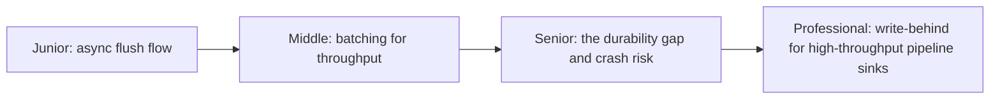
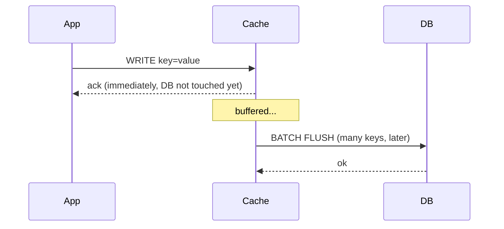

# Write-Behind (Write-Back) Caching

> Write to the cache immediately and acknowledge the caller — then flush to
> the durable store asynchronously, in batches. Maximizes write throughput at
> the cost of a durability gap between "acknowledged" and "actually safe."

## Choose a level

| Level | Guide | You are done when |
|---|---|---|
| Junior | [The async flush flow](junior.md) | You can explain why the caller gets an ack before the database write happens. |
| Middle | [Batching for throughput](middle.md) | You can explain why batching flushes reduces database load per write. |
| Senior | [The durability gap](senior.md) | You can explain what data is lost if the cache crashes before a flush. |
| Professional | [High-throughput pipeline sinks](professional.md) | You can decide when a pipeline sink can safely accept write-behind's durability trade-off. |

## Practice rule

Before adopting write-behind anywhere, ask: "if this process crashes right
now, what unflushed writes does the caller believe succeeded that actually
never reached durable storage?" If that answer is unacceptable for the data
in question, write-behind is the wrong pattern for it.

## Related

- [Write-Through](../02-write-through/README.md)
- [Cache-Aside](../01-cache-aside/README.md)
- [Transactions & ACID — Durability](../../../transaction/07-transactions-and-acid/junior.md)
