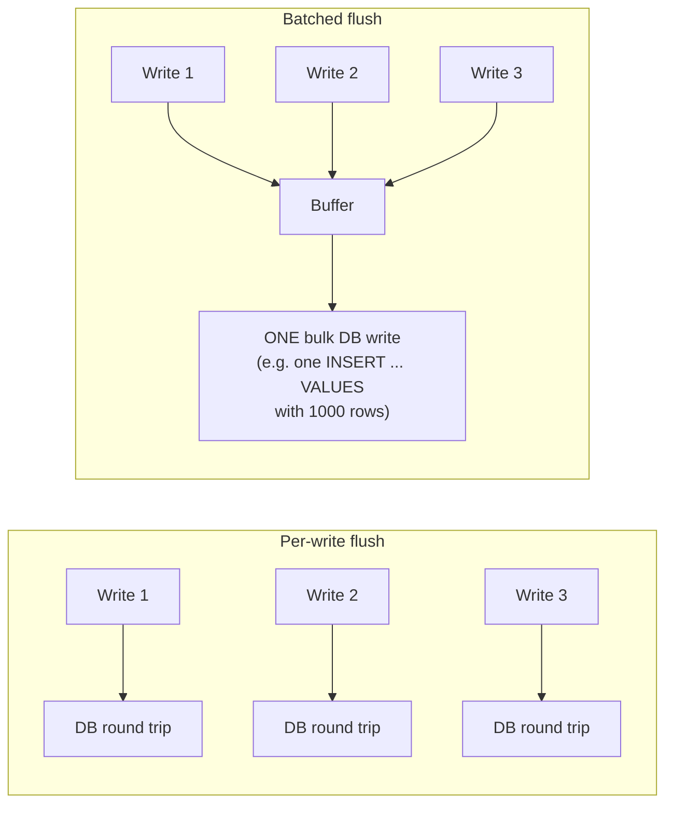

# Write-Behind — Middle

<!-- level-focus -->
At middle level, focus on this question:

> Why does batching flushes reduce database load, and how do you choose a
> batch size or flush interval?

Prerequisite: [`junior.md`](junior.md).

---

## Batching turns many small writes into few large ones



If a key is incremented 1,000 times in a second (a view counter, a hit
counter), write-behind can coalesce all 1,000 increments into a **single**
database write (`UPDATE counter SET value = value + 1000`), instead of 1,000
separate round trips — this is the throughput win write-behind offers that
neither cache-aside nor write-through can match, because both of those tie
each logical write to its own database operation.

## Choosing flush parameters

| Parameter | Trade-off |
|---|---|
| **Flush interval** (e.g. every 5 seconds) | Shorter: smaller durability gap, more frequent (smaller) DB writes. Longer: bigger throughput win from batching, larger durability gap. |
| **Buffer size threshold** (e.g. flush at 10,000 pending writes) | Prevents unbounded memory growth if writes arrive faster than flushes can keep up; forces a flush before the interval elapses under load. |
| **Coalescing strategy** | For counters/aggregates: sum deltas into one write. For arbitrary key updates: keep only the latest value per key (older intermediate values for the same key are never separately durable — see `senior.md`). |

```python
# Simplified coalescing buffer
pending = defaultdict(int)

def update_counter(key, delta):
    pending[key] += delta   # coalesced in memory
    return "ok"

def flush():
    for key, total_delta in pending.items():
        db.execute("UPDATE counters SET value = value + %s WHERE key = %s",
                   total_delta, key)
    pending.clear()
```

> 🎓 **Takeaway:** the throughput gain scales with how much coalescing
> happens — a key written once between flushes gains nothing from batching;
> a key written thousands of times between flushes gains everything.
> Write-behind is most valuable for hot, frequently-updated keys, not
> uniformly-distributed write traffic.

## Test yourself

1. If every key in your workload is written exactly once, does write-behind
   still offer a throughput advantage over write-through? Why or why not?
2. Why does a buffer-size threshold matter even if your flush interval is
   already short?
3. For a key updated 5 times between flushes with values A, B, C, D, E — if
   you're not summing deltas but overwriting, what value ends up durable,
   and what happened to B, C, D?

Continue to [`senior.md`](senior.md).
