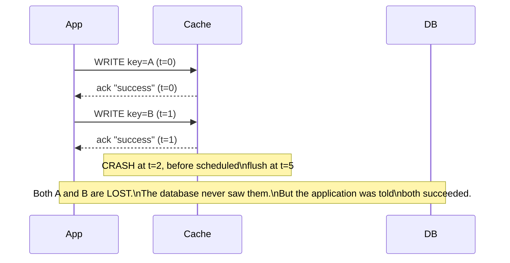
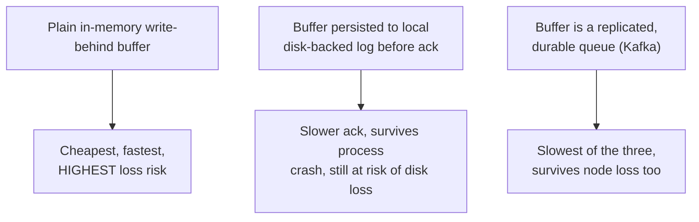

# Write-Behind — Senior

<!-- level-focus -->
At senior level, focus on this question:

> If the cache/buffer crashes before a flush, exactly what data is lost —
> and how do you bound or eliminate that loss?

Prerequisite: [`middle.md`](middle.md).

---

## The durability gap, made concrete

Every write acknowledged between the last successful flush and a crash is
**permanently lost**, even though the caller was told it succeeded. This is
a direct violation of the "D" in ACID (Durability, see
[Transactions & ACID — junior](../../../transaction/07-transactions-and-acid/junior.md))
for anything routed through write-behind — which is why write-behind should
never be the *sole* record of anything that matters if lost.

## Bounding the loss

- **Shorter flush intervals** reduce the maximum window of loss, at the cost
  of the throughput benefits from `middle.md` — a direct dial between
  "how much can we lose" and "how much do we save."
- **Write-ahead the buffer itself** — persist the pending-write buffer to a
  local disk-backed log (or a durable queue like Kafka) before acking the
  caller, so a crash can replay unflushed writes from the log on restart
  instead of losing them outright. This converts write-behind's ack into "the
  write is durable in *some* system," even if not yet in the final
  destination — narrowing, though not eliminating, the true loss window to
  "both the buffer's log and the database are unavailable simultaneously."
- **Replication of the buffer** (a replicated in-memory cache, or a
  Kafka-backed buffer with its own replication) further reduces the odds of
  total loss, at added infrastructure cost.
- **Never use plain write-behind for data where losing an acknowledged write
  is unacceptable** — financial transactions, inventory decrements, anything
  audited. Use write-through (`../02-write-through/README.md`) or a durable
  queue with at-least-once delivery instead for those.

> 🎯 **Senior takeaway:** write-behind's ack is a promise about a buffer, not
> about the database. The moment you use write-behind, you've implicitly
> decided the buffer's durability guarantee (in-memory, disk-logged, or
> replicated) *is* your actual durability guarantee for that data — choose it
> deliberately, per the value of what you'd lose.

## Test yourself

1. In the sequence diagram, exactly which writes are lost and why — is it
   all writes since the last flush, or something more subtle?
2. Why does write-ahead-logging the buffer itself narrow, but not fully
   eliminate, the loss window?
3. Name one type of data in a system you've worked on where write-behind's
   loss risk would be completely unacceptable, and one where it would be
   perfectly fine.

Continue to [`professional.md`](professional.md) to apply write-behind
correctly to high-throughput pipeline sinks.
