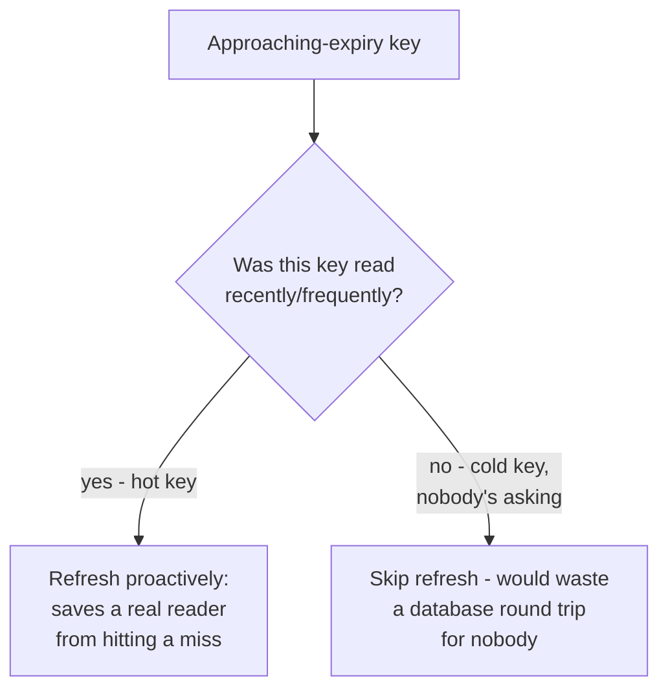

# Refresh-Ahead — Middle

<!-- level-focus -->
At middle level, focus on this question:

> How do you decide which keys are worth proactively refreshing?

Prerequisite: [`junior.md`](junior.md).

---

## Refresh-ahead only pays off for keys that are actually being read



If a key was cached once and never read again before expiry, proactively
refreshing it is pure waste — nobody benefits, and you've spent a database
query for nothing. The heuristic that matters is **access frequency**, not
just "is this key about to expire."

## A practical heuristic

```python
def should_refresh_ahead(key, access_log):
    recent_reads = access_log.count_reads(key, window="last_60s")
    return recent_reads >= MIN_READS_TO_QUALIFY   # e.g. 5+
```

Most production caching layers (Redis with a companion process, or a
caching library with built-in refresh-ahead support) track a lightweight
access counter per key and only schedule background refreshes for keys that
cross a "hot enough" threshold — everything else falls back to plain
cache-aside behavior (miss → refetch on the next real request).

## Tuning the refresh trigger point

| Trigger point | Trade-off |
|---|---|
| Very early (e.g. at 50% of TTL) | Almost never misses, but refreshes far more often than strictly necessary — more database load. |
| Late (e.g. at 95% of TTL) | Fewer wasted refreshes, but a slow refresh (database hiccup) has less buffer before the key would actually expire, risking a miss anyway. |
| Typical middle ground | 70-80% of TTL elapsed — enough buffer for a normal-latency refresh to complete before real expiry, without excessive redundant refreshing. |

> 🎓 **Takeaway:** refresh-ahead is a targeted optimization for a small set
> of genuinely hot keys, not a blanket policy for every cached key — applying
> it universally converts "wait for a miss" cost into "constant background
> refresh" cost, which is often a worse trade for the long tail of
> rarely-read keys.

## Test yourself

1. Why would applying refresh-ahead to every cached key, regardless of read
   frequency, likely increase total database load rather than decrease it?
2. What's the risk of setting the refresh trigger too late (e.g. 95% of TTL)
   if the database is occasionally slow to respond?
3. Design an access-frequency threshold and trigger point for a key you'd
   expect to be read thousands of times per minute versus one read a few
   times per hour.

Continue to [`senior.md`](senior.md).
