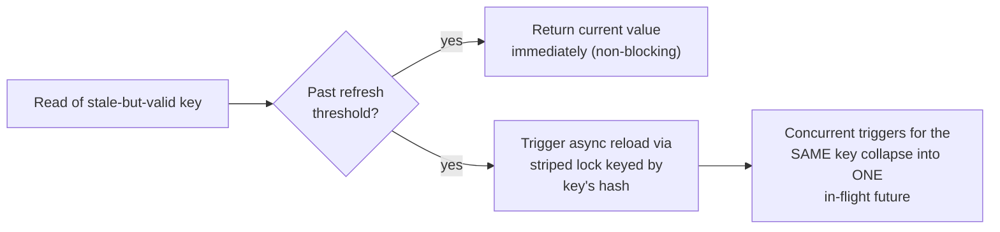
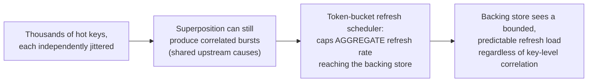

# Refresh-Ahead — Professional

<!-- level-focus -->
At professional level, focus on this question:

> How do production caching libraries actually implement refresh-ahead
> internally (the exact scheduling and concurrency-control mechanisms), and
> what queueing-theory result explains why naive refresh scheduling fails
> at scale?

Prerequisite: [`senior.md`](senior.md).

---

## Caffeine's actual refresh-ahead implementation

Caffeine (the de facto standard JVM caching library, used inside Guava's
successor and countless production Java systems) implements refresh-ahead
via `refreshAfterWrite`, and its internal mechanism is instructive: on a
read of an entry past its refresh threshold, Caffeine **returns the stale
value immediately to the caller** and asynchronously triggers exactly one
reload via a `CompletableFuture`, using an internal **striped lock keyed by
the cache key's hash** (not a single global lock) so concurrent refresh
triggers for *different* keys never contend with each other, while
concurrent triggers for the *same* key correctly collapse into a single
in-flight reload — this is the production-grade version of the "acquire a
lock" pseudocode from `senior.md`, implemented without a separate external
lock service, using the cache's own internal concurrency primitives.



## Why naive fixed-interval refresh scheduling fails: a queueing theory result

If every hot key's refresh is scheduled independently against a wall-clock
TTL (as in `middle.md`/`senior.md`'s naive framing), the arrival pattern of
refresh *triggers* onto the backing store approaches a **Poisson process**
under real traffic timing jitter for a single key, but the **superposition of
many independent Poisson-like refresh streams across thousands of hot keys
does not stay well-behaved** — it can produce correlated bursts even with
jitter applied per-key, because jitter reduces but does not eliminate
higher-order correlation effects from shared upstream causes (a deploy, a
config change, a shared TTL default). The formal remediation used in
production-grade rate-limited refresh systems is a **token-bucket-limited
refresh scheduler**: cap the *aggregate* refresh rate against the backing
store to a fixed ceiling (tokens replenished at a steady rate), queueing
excess refresh triggers rather than letting the raw superposition of
independently-jittered per-key schedules dictate load on the backing store
directly — this decouples "how many keys want to refresh right now" from
"how much load actually reaches the database," which per-key jitter alone
does not guarantee.



## Production checklist (staff-level)

1. **Use a production-grade caching library's built-in refresh-ahead
   (Caffeine's `refreshAfterWrite`, or an equivalent) rather than
   hand-rolling the lock/schedule mechanism** — the striped-locking and
   single-flight-per-key correctness is subtle to get right and already
   solved in well-audited libraries.
2. **Cap aggregate refresh rate against the backing store with a
   token-bucket or equivalent global rate limiter**, not just per-key
   jitter, for any system with many independently-hot keys sharing a
   backing store — per-key jitter alone does not bound worst-case
   correlated load.
3. **Instrument refresh queue depth/rejection rate as a first-class
   metric** when using a rate-limited refresh scheduler — a growing queue
   under the rate cap is a leading indicator that your hot-key count or
   individual refresh cost has outgrown the configured ceiling.
4. **Distinguish "refresh returned stale data because it's in-flight" from
   "refresh failed and the key is now expired" in monitoring** — these are
   different failure severities and should page differently.
5. **In a capacity-planning review for refresh-ahead-heavy systems, model
   the backing store's sustainable refresh QPS explicitly** as a hard
   ceiling input to the rate limiter's token replenishment rate, not as an
   assumption that per-key jitter alone will keep aggregate load
   reasonable.

## Cheat Sheet

```text
+------------------------------------------------------------------+
|              REFRESH-AHEAD — INTERNALS & SCALE                      |
+------------------------------------------------------------------+
| Caffeine refreshAfterWrite: stale value returned IMMEDIATELY,          |
| async reload triggered via a STRIPED LOCK keyed by hash - per-key      |
| collapse of concurrent triggers into one in-flight future, no          |
| global lock contention across different keys                           |
+------------------------------------------------------------------+
| Per-key jitter reduces but does NOT eliminate correlated refresh       |
| bursts across many hot keys (shared upstream causes still correlate    |
| the superposition). Fix: TOKEN-BUCKET rate limiter capping the         |
| AGGREGATE refresh rate reaching the backing store, decoupling "how     |
| many keys want to refresh" from "how much load actually lands"        |
+------------------------------------------------------------------+
```

## Test yourself

1. Explain why Caffeine's striped-lock design lets refreshes for different
   keys proceed fully in parallel while still preventing duplicate
   concurrent refreshes of the SAME key.
2. Why does applying random jitter independently to each hot key's refresh
   schedule fail to fully prevent correlated load spikes on the backing
   store, even though it clearly helps?
3. Design a token-bucket-based refresh scheduler for a system with 50,000
   hot keys and a backing store that can sustainably handle 200 refresh
   queries/second.

## Further Reading

- Ben Manes — Caffeine caching library source and design documentation
  (`refreshAfterWrite`, striped locking internals).
- Cormode & Muthukrishnan — general queueing/rate-limiting theory
  underlying token-bucket algorithms (also see RFC 2697/2698 for formal
  token-bucket definitions used in networking, directly transferable here).
- See also: [Cache Stampede & Hot Keys — professional](../08-cache-stampede-and-hot-keys/professional.md),
  [Cache-Aside — professional](../01-cache-aside/professional.md).
