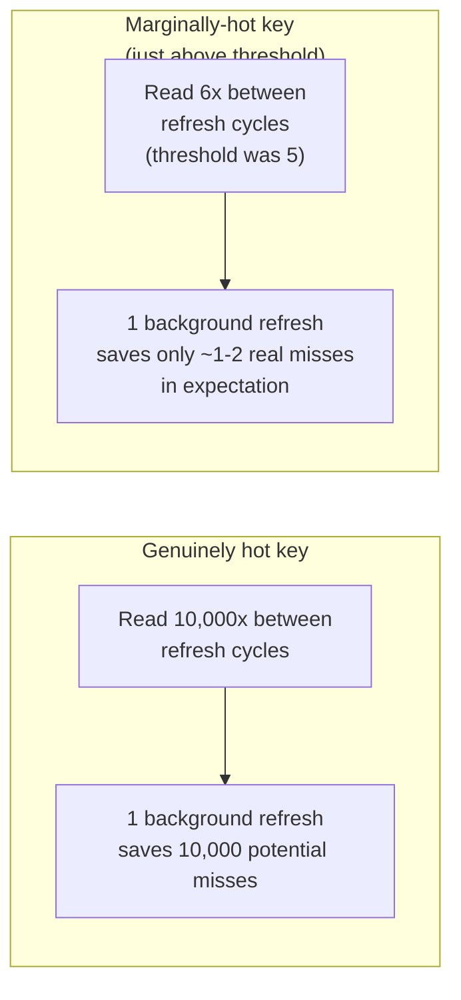
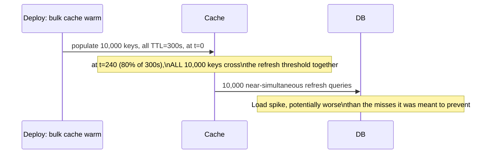

# Refresh-Ahead — Senior

<!-- level-focus -->
At senior level, focus on this question:

> Under what conditions does refresh-ahead waste more work than the misses it
> prevents, and how do you detect that it's happening?

Prerequisite: [`middle.md`](middle.md).

---

## The waste case: over-triggering on marginal keys



If your "hot enough" threshold from `middle.md` is set too low, a large
number of keys that qualify only marginally each trigger a full background
refresh for a tiny expected benefit — the aggregate database load from all
these marginal refreshes can exceed what plain cache-aside would have cost
in occasional misses for the same keys.

## Refresh storms from correlated TTLs

If many keys were all populated around the same time (e.g. a cache warmed in
bulk after a deploy) and share the same TTL, their refresh triggers all fire
in a tight window too — turning what should be a smooth, spread-out
background load into a **refresh storm** hitting the database all at once.



**Mitigation: jitter.** Add a small random offset to each key's TTL (or to
its refresh trigger point) at population time, so refreshes spread out over
a window instead of firing in lockstep.

```python
ttl = base_ttl + random.uniform(-jitter_range, jitter_range)
```

## Detecting waste in production

Track, per refresh-ahead-managed key or key pattern:

- **Refreshes triggered** vs. **actual reads that would have missed
  otherwise** (reconstructable by comparing against what a plain
  cache-aside baseline would have experienced, or by temporarily disabling
  refresh-ahead for a sample of keys as an A/B comparison).
- **Refresh cost vs. miss cost**, in database load terms — if a refresh
  query is expensive (a heavy aggregation) and the key is only marginally
  hot, the miss might genuinely be cheaper than preventing it.

> 🎯 **Senior takeaway:** refresh-ahead's benefit is probabilistic
> (proportional to real read frequency during the refresh window), while its
> cost is deterministic (one refresh query, every cycle, regardless of
> whether anyone was about to read it). Set thresholds conservatively, add
> jitter to prevent correlated storms, and measure — don't assume
> "proactive" always beats "reactive."

## Test yourself

1. Why can a low "hot enough" threshold make refresh-ahead's total database
   load *higher* than plain cache-aside's occasional-miss load, for the same
   set of keys?
2. Walk through why a bulk cache warm-up at deploy time creates a correlated
   refresh storm, and how jitter fixes it.
3. Design an A/B measurement to determine whether refresh-ahead is actually
   net-beneficial for a specific key pattern in your system.

Continue to [`professional.md`](professional.md) to apply refresh-ahead to a
pipeline-computed hot aggregate.
