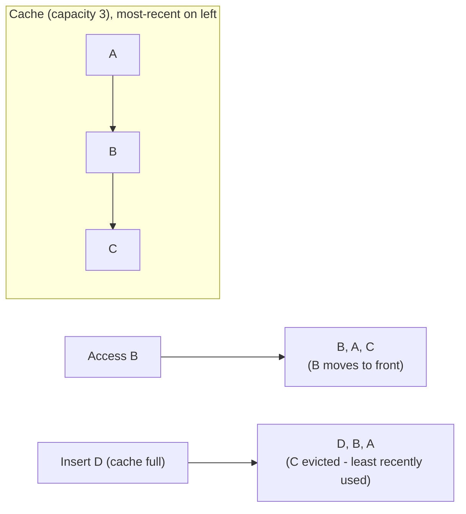

# Cache Eviction Policies — Junior

<!-- level-focus -->
At junior level, focus on this question:

> Why must a cache evict anything at all, and how does the most common
> policy (LRU) decide what to remove?

---

## Caches are finite

A cache lives in memory (or a bounded fast-storage tier), which is always
smaller than "everything you might want to cache" for any real workload.
Once full, adding a new item requires **evicting** an existing one to make
room — the eviction policy is the rule that decides which one.

## LRU: Least Recently Used



LRU evicts whichever item hasn't been **accessed** (read or written) for the
longest time — the intuition being that data you used recently is more
likely to be used again soon than data you haven't touched in a while (this
principle is called "temporal locality").

```python
from collections import OrderedDict

class LRUCache:
    def __init__(self, capacity):
        self.capacity = capacity
        self.cache = OrderedDict()

    def get(self, key):
        if key not in self.cache:
            return None
        self.cache.move_to_end(key)   # mark as recently used
        return self.cache[key]

    def put(self, key, value):
        if key in self.cache:
            self.cache.move_to_end(key)
        self.cache[key] = value
        if len(self.cache) > self.capacity:
            self.cache.popitem(last=False)   # evict least recently used
```

> 🎓 **Takeaway:** LRU is popular because it's cheap to implement (an ordered
> structure updated on every access) and works well for the common case where
> recently-accessed data predicts near-future access. It is not the only
> policy, and it's not always the right one — `middle.md` covers the
> alternatives.

## Test yourself

1. In the diagram, why is `C` evicted instead of `A`, even though `A` was
   inserted before `B`?
2. Why does `get()` in the code above call `move_to_end`, even though it's
   only reading, not writing?
3. What would happen to LRU's effectiveness if your access pattern had no
   temporal locality at all (every access was to a genuinely random key)?

Continue to [`middle.md`](middle.md).
