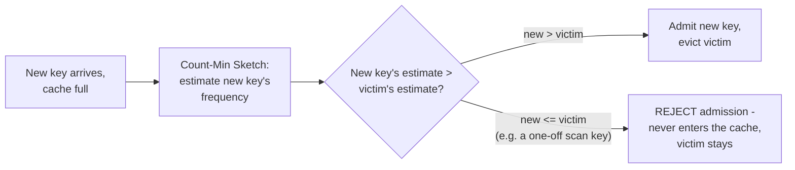

# Cache Eviction Policies — Professional

<!-- level-focus -->
At professional level, focus on this question:

> How does TinyLFU's admission filter actually work at the bit level, and
> why does the theoretical Belady's optimal algorithm matter even though
> it's unimplementable in practice?

Prerequisite: [`senior.md`](senior.md).

---

## Belady's algorithm: the unreachable optimum every real policy is measured against

**Belady's MIN algorithm** (1966) is the provably optimal cache eviction
policy: always evict the item that will be used **furthest in the future**.
It's unimplementable in any online system because it requires knowing the
future access sequence — but it's the theoretical ceiling every real policy
is benchmarked against in cache-simulation research, and its existence
explains *why* eviction policy research is fundamentally about
**approximating future access probability from past access patterns**,
which is precisely what LRU (recency), LFU (frequency), and their hybrids
are each betting on with different statistical assumptions. A staff-level
framing: when evaluating a new eviction policy, ask "what assumption about
future access does this make, and how does it approximate Belady's oracle
knowledge from historical signal" — this reframes policy comparison from
folklore ("LRU is standard") to a precise question about your workload's
actual statistical properties.

## TinyLFU: the actual bit-level admission mechanism

TinyLFU (used in Caffeine) doesn't just track frequency — it uses a
**Count-Min Sketch**, a probabilistic frequency-counting structure using
multiple hash functions mapping into small fixed-width counter arrays,
giving an *approximate* frequency count for any key using O(1) space
regardless of the actual keyspace cardinality (at the cost of occasional
overestimation from hash collisions, never underestimation). On a cache
miss for a new candidate key, TinyLFU compares the candidate's estimated
frequency against the frequency of the item that would need to be evicted to
admit it — **the candidate is only admitted if its estimated frequency
exceeds the eviction victim's** — this is the specific mechanism that gives
TinyLFU its scan resistance (`senior.md`'s topic): a one-off scan key has a
near-zero frequency estimate and simply fails the admission check outright,
never even entering the cache to threaten a genuinely hot item.



Because a Count-Min Sketch would grow stale (frequencies from months ago
still counting) without decay, TinyLFU implements a **periodic halving**
of all counters once total increments cross a threshold (typically related
to cache size) — an aging mechanism ensuring the frequency signal reflects
*recent* popularity, not all-time cumulative popularity, directly addressing
the "popular last week, cold today" LFU weakness identified in `middle.md`,
without requiring per-key timestamp bookkeeping.

## W-TinyLFU: combining recency and frequency with a formal admission window

Full TinyLFU alone can still underperform on strongly recency-biased
workloads (a genuinely new, suddenly-popular item needs *some* chance to
prove itself before accumulating frequency). **Window TinyLFU (W-TinyLFU)**,
Caffeine's actual production policy, splits the cache into a small
**admission window** (a plain LRU segment, typically ~1% of total capacity)
and a **main segment** governed by the TinyLFU-filtered admission policy —
new items enter the window first; only items that survive eviction pressure
within the window and prove sufficient relative frequency get promoted into
the frequency-filtered main segment. This hybrid is empirically shown (in
Caffeine's own published benchmarks against production traces) to match or
beat both pure LRU and pure LFU/ARC across a wide range of real-world access
pattern shapes, precisely because it hedges between the two competing bets
(`middle.md`) rather than committing to one.

## Production checklist (staff-level)

1. **When selecting/tuning a caching library, understand which specific
   admission/eviction algorithm it implements** (plain LRU, ARC, TinyLFU,
   W-TinyLFU) and its specific admission-window sizing, rather than treating
   "it's a good cache library" as sufficient — the algorithm choice has
   measurable hit-rate consequences validated against real trace
   benchmarks, not just theory.
2. **Use a Count-Min-Sketch-based frequency estimate (or a library that
   already implements one) instead of exact per-key counters** for any
   frequency-aware eviction policy at large keyspace scale — exact counting
   doesn't scale in memory the way an approximate sketch does, and the
   approximation's error characteristics (overestimate-only, never
   underestimate) are well-understood and acceptable for this use case.
3. **Validate any eviction-policy change against a replay of real
   production access traces** before rolling it out — synthetic benchmarks
   routinely fail to capture the specific correlation/skew structure that
   determines which policy actually wins for your workload.
4. **Size the admission window (in a W-TinyLFU-style hybrid) based on how
   recency-biased your actual workload is** — a workload with almost no
   recency effect (pure stable popularity) can shrink the window; a
   workload with strong recency bursts (breaking news, flash sales) needs a
   larger one.
5. **Treat "what's our theoretical hit-rate ceiling" (an offline Belady
   simulation on historical trace data) as a legitimate capacity-planning
   input** — it tells you whether a hit-rate shortfall is a policy problem
   (fixable by switching algorithms) or a cache-size problem (not fixable by
   any policy change, since even the optimal offline algorithm couldn't do
   meaningfully better with the same capacity).

## Cheat Sheet

```text
+------------------------------------------------------------------+
|            EVICTION POLICIES — INTERNALS & SCALE                    |
+------------------------------------------------------------------+
| Belady's MIN (1966): provably optimal, requires future knowledge,     |
| UNIMPLEMENTABLE online - but the benchmark every real policy          |
| approximates. Run an offline Belady simulation on trace data to       |
| find your theoretical hit-rate ceiling for capacity planning           |
+------------------------------------------------------------------+
| TinyLFU: Count-Min Sketch gives O(1)-space approximate frequency       |
| per key (overestimate-only error). Admission check: new key only       |
| admitted if its estimate BEATS the eviction victim's - this is         |
| exactly what rejects one-off scan keys before they ever enter          |
| Periodic counter halving = aging, so frequency reflects RECENT         |
| popularity, not all-time cumulative popularity                         |
+------------------------------------------------------------------+
| W-TinyLFU (Caffeine's real policy): small LRU admission window          |
| (~1% capacity) + TinyLFU-filtered main segment - hedges between        |
| recency and frequency bets, empirically matches/beats pure LRU/LFU/ARC |
| across real production trace benchmarks                                |
+------------------------------------------------------------------+
```

## Test yourself

1. Why is Belady's algorithm useful for capacity planning even though it
   can never be implemented in a real online cache?
2. Walk through, at the bit/hash-function level, why a Count-Min Sketch can
   only overestimate frequency, never underestimate it — and why that
   asymmetry is acceptable for TinyLFU's admission check.
3. Design a validation plan to decide whether a hit-rate shortfall in
   production is better fixed by switching from LRU to W-TinyLFU, or by
   simply increasing cache size.

## Further Reading

- Belady — "A Study of Replacement Algorithms for a Virtual-Storage
  Computer" (1966, IBM Systems Journal — the original optimal-eviction
  paper).
- Einziger, Friedman, Manes — "TinyLFU: A Highly Efficient Cache Admission
  Policy" (the original TinyLFU paper) and Caffeine's own published
  W-TinyLFU benchmark results against production traces.
- Cormode & Muthukrishnan — "An Improved Data Stream Summary: The Count-Min
  Sketch and its Applications" (the underlying sketch structure).
- See also: [Cache Stampede & Hot Keys — professional](../08-cache-stampede-and-hot-keys/professional.md).
