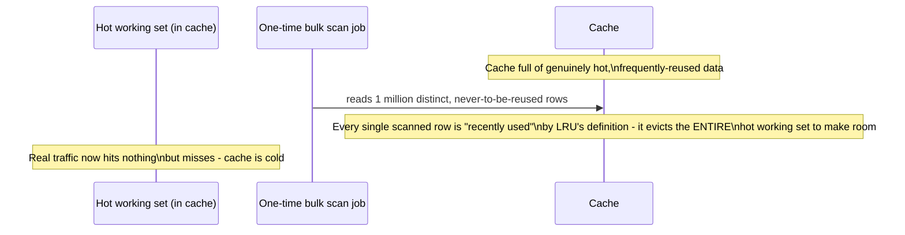
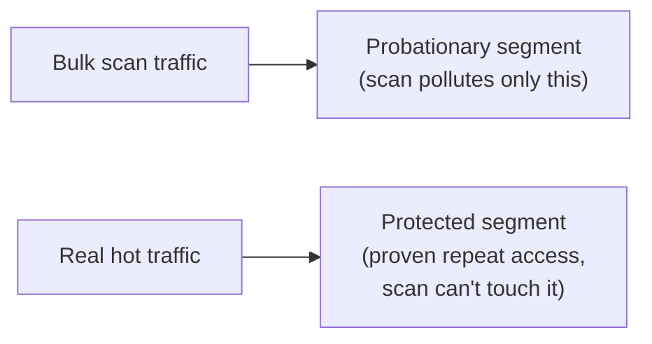

# Cache Eviction Policies — Senior

<!-- level-focus -->
At senior level, focus on this question:

> How can a single bulk scan silently destroy an LRU cache's effectiveness,
> and how do you defend against it?

Prerequisite: [`middle.md`](middle.md).

---

## Scan pollution: LRU's classic pathology

LRU's only signal is "was this accessed recently" — it has no concept of
"will this be accessed *again*." A batch job, an analytics query, or a
misbehaving crawler that reads a huge number of distinct keys exactly once
each looks, to LRU, indistinguishable from legitimate hot traffic — and it
will happily evict your entire genuinely-hot working set to make room for
data that will never be read again. This is called **scan pollution** or a
cache being "polluted" by a scan.

## Scan-resistant variants

| Technique | How it defends against scan pollution |
|---|---|
| **LRU-K** (e.g. LRU-2) | Tracks the time of the *K-th* most recent access, not just the most recent one — an item touched once during a scan doesn't look "hot" until it's been accessed K times, which one-off scan reads never satisfy. |
| **ARC (Adaptive Replacement Cache)** | Maintains two lists — recently-used-once and used-multiple-times — and adaptively balances between recency and frequency, self-tuning against scan-like patterns. |
| **Segmented LRU (SLRU)** | Splits the cache into a "probationary" segment (new/one-time entries) and a "protected" segment (proven repeat-access entries); a scan fills only the probationary segment, leaving the protected segment (your real hot set) untouched. |
| **TinyLFU** (used by Caffeine, a popular Java caching library) | Uses a frequency sketch to admit new items only if they're likely to be more valuable than what they'd evict — actively resisting low-value churn from one-off accesses. |

> 🎯 **Senior takeaway:** plain LRU is a reasonable default, but any
> production system exposed to occasional bulk/scan-style access patterns
> (a nightly batch job reading through a table backed by the same cache,
> an analytics query, a crawler) should use a scan-resistant variant (ARC,
> SLRU, or TinyLFU) — or explicitly route scan-style access around the cache
> entirely, bypassing it rather than polluting it.

## Test yourself

1. Why does plain LRU have no way to distinguish "accessed once by a
   one-time batch job" from "accessed once by the start of a new hot trend"?
2. Explain, in your own words, how a segmented LRU's two-tier structure
   specifically defends against the scenario in the sequence diagram.
3. Propose an alternative fix that doesn't require changing the eviction
   policy at all — what could you do at the application layer instead to
   prevent a batch job from polluting a shared cache?

Continue to [`professional.md`](professional.md) to choose an eviction
policy for a feature-store or pipeline caching layer.
