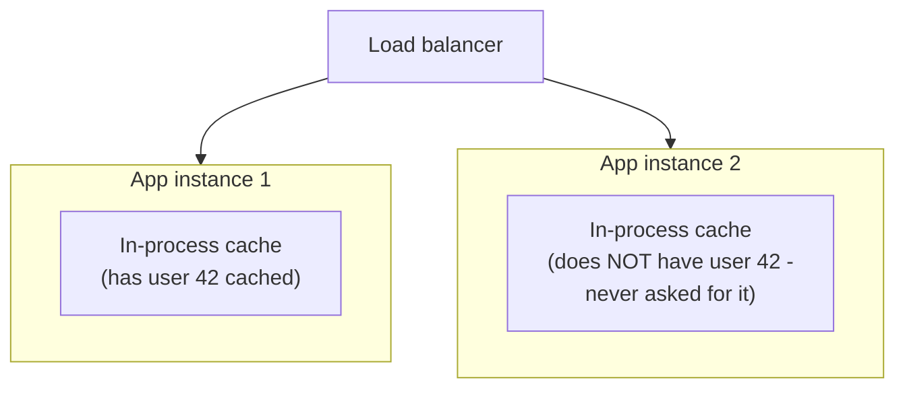
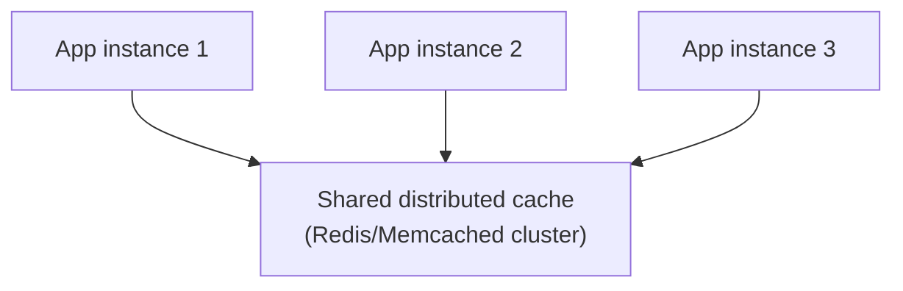

# Types of Caching — Junior

<!-- level-focus -->
At junior level, focus on this question:

> Why does an in-process cache stop working correctly the moment you run
> more than one instance of your application?

---

## In-process caching

```python
_cache = {}   # a plain dict, living in this process's memory

def get_user(user_id):
    if user_id in _cache:
        return _cache[user_id]
    row = db.query(...)
    _cache[user_id] = row
    return row
```

This is the simplest possible cache: a variable in your application's own
memory. It's extremely fast (no network call at all) but has one defining
limitation — **it only exists inside this one process.**



If you run 2 instances behind a load balancer, each has its **own**,
completely independent cache — a value cached by instance 1 is invisible to
instance 2, so the effective hit rate across your whole fleet is much lower
than a single instance's hit rate would suggest, and each instance
duplicates the memory cost.

## Distributed caching fixes the sharing problem



A **distributed cache** (Redis, Memcached) runs as its own separate service;
every application instance talks to the same shared cache over the network.
A value cached by instance 1's request is immediately available to instance
2 and 3 — one shared cache, one shared hit rate, no duplicated memory across
instances.

> 🎓 **Takeaway:** in-process caching is the fastest option but doesn't scale
> past one instance without duplicating effort; distributed caching adds a
> network hop but shares state across every instance that needs it. Most
> production systems with more than one instance need the distributed kind
> for anything beyond a tiny, rarely-changing lookup table.

## Test yourself

1. Why does running 5 app instances with in-process caching effectively give
   you 5 separate, smaller caches instead of one big one?
2. What's the latency trade-off between in-process and distributed caching?
3. Give one kind of data where in-process caching is genuinely fine despite
   multiple instances (hint: think about data that rarely or never changes).

Continue to [`middle.md`](middle.md).
