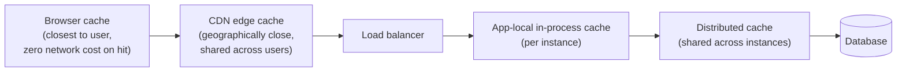

# Types of Caching — Middle

<!-- level-focus -->
At middle level, focus on this question:

> Where do CDN and browser caching fit relative to your application's own
> caching layers?

Prerequisite: [`junior.md`](junior.md).

---

## The full request path

A request only reaches your application's caches (and the database) if it
misses at every layer above it. Each layer closer to the user that can serve
a hit saves progressively more — a browser cache hit costs the user
literally zero network time; a database hit is the most expensive path of
all.

| Layer | Who controls it | Typical TTL | Shared across |
|---|---|---|---|
| **Browser cache** | `Cache-Control` headers your app sends | Seconds to days | Just that one user's browser |
| **CDN edge cache** | Your CDN config (Cloudflare, Fastly, CloudFront) | Seconds to hours | Every user hitting that edge location |
| **App in-process cache** | Your application code | Seconds to minutes | Just that one process |
| **Distributed cache** | Your application code + Redis/Memcached config | Seconds to hours | Every instance of your application |

## Why this matters for a data pipeline

A data platform doesn't just serve web pages, but the same layered principle
applies to any served-data path: a public API exposing aggregated metrics
might sit behind a CDN (for public, cacheable GET requests), with the API
service itself using a distributed cache in front of the warehouse. Getting
the TTL **consistent across layers** matters — if the CDN caches a response
for 5 minutes but the underlying distributed cache refreshes every 30
seconds, users can still see data up to 5 minutes stale, because the CDN
layer is the one actually serving them, regardless of how fresh the layers
behind it are.

> 🎓 **Takeaway:** the effective staleness a user experiences is bounded by
> the **least fresh** layer in the chain that served their request, not the
> freshest one — a distributed cache refreshing every second is meaningless
> if a CDN in front of it caches for an hour.

## Test yourself

1. If your CDN caches an API response for 10 minutes and your distributed
   cache behind it has a 30-second TTL, what's the actual maximum staleness a
   user could see?
2. Why would you set `Cache-Control: private` on a response containing
   user-specific data, to prevent it from being cached at the CDN layer?
3. For a public "total signups today" counter endpoint, which layers would
   you cache at, and with what relative TTLs?

Continue to [`senior.md`](senior.md).
