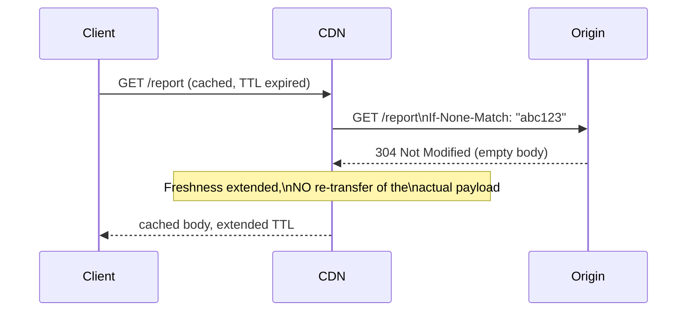
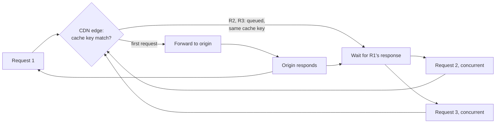

# Types of Caching — Professional

<!-- level-focus -->
At professional level, focus on this question:

> What does HTTP caching's actual validator machinery (ETags, conditional
> requests) do at the protocol level, and how does CDN request-collapsing
> internally prevent an origin stampede?

Prerequisite: [`senior.md`](senior.md).

---

## ETags and conditional requests: revalidation without re-transfer

A naive mental model of HTTP caching is "cached until TTL, then a full
re-fetch." The actual protocol machinery is more precise: on TTL expiry, a
compliant client/CDN doesn't necessarily re-fetch the full response — it
sends a **conditional request** (`If-None-Match: "<etag>"` or
`If-Modified-Since: <date>`) carrying the previously-cached response's
validator. If the origin's current content matches, it returns
**`304 Not Modified`** with an empty body — the cache entry's freshness is
extended without re-transferring the payload at all. The **strength of the
guarantee depends on the ETag's construction**: a strong ETag
(byte-for-byte content hash) guarantees identical bytes; a weak ETag
(`W/"..."`, semantically-equivalent-but-not-byte-identical) permits the
origin to signal "functionally the same" for content that varies
insignificantly (e.g. whitespace, non-semantic ordering) — the
professional-level distinction matters directly for range requests and
partial-content caching, where a weak ETag is explicitly disallowed by the
HTTP spec because it cannot guarantee byte-level consistency across ranges.



## Request collapsing: how a CDN prevents an origin stampede structurally

CDN edge nodes implement **request collapsing** (also called
"coalescing"): when multiple concurrent requests arrive for the same
not-yet-cached (or expired) URL, the edge node holds all but the first
request in a **wait queue keyed by the request's cache key**, forwards
exactly one request to the origin, and upon response, serves the cached
result to every queued request simultaneously — this is the CDN-layer,
protocol-native implementation of the exact single-flight mechanism covered
in the Cache Stampede professional page, but implemented at the reverse-proxy
layer (often via Varnish's or Nginx's specific "lock" directives, or a
managed CDN's built-in behavior) rather than in application code — meaning
correctly configuring or verifying this behavior is a **CDN configuration
review item**, not something application code can control or bypass at
that layer.



## Vary header interactions: the silent cache-key multiplier

The `Vary` header tells caches which request headers, in addition to the
URL, must match for a cached response to be reusable — `Vary: Accept-Encoding`
is common and cheap (2-3 variants: gzip/br/identity). A poorly understood
production risk: `Vary: User-Agent` or `Vary: Cookie` can **explode the
effective cache-key space** to near-uniqueness per request (thousands of
distinct User-Agent strings, or a unique cookie per session), silently
reducing a CDN's hit rate to near-zero for that resource while looking, from
application code, like caching is correctly configured — this is a common,
hard-to-spot cause of "we added caching and it didn't help" incidents,
diagnosable only by inspecting the actual `Vary` header set on responses and
the resulting cache-key cardinality at the CDN layer.

## Production checklist (staff-level)

1. **Use strong ETags (content-hash-based) for any resource involved in
   range requests or requiring byte-level cache consistency guarantees**;
   reserve weak ETags for cases where semantic equivalence, not byte
   equivalence, is the actual freshness contract.
2. **Verify request collapsing is actually enabled and correctly scoped**
   at your CDN/reverse-proxy layer for any endpoint expected to receive
   high concurrent traffic on cache miss — don't assume it's default
   behavior everywhere; some CDN configurations and cache-control directives
   (e.g. certain `Cache-Control: private` combinations) disable it.
3. **Audit every `Vary` header your services emit for cache-key
   cardinality impact** — treat `Vary: Cookie` and `Vary: User-Agent`
   specifically as red flags requiring explicit justification in review,
   since they're the most common silent hit-rate killers.
4. **Instrument CDN hit ratio broken down by cache key dimension (URL,
   plus each `Vary`'d header)** where your CDN provider supports it, not
   just an aggregate hit ratio — an aggregate number can hide a
   near-zero-hit-rate resource inside an otherwise healthy average.
5. **In an incident review for "caching isn't helping," check the `Vary`
   header set and the request-collapsing configuration first**, before
   assuming the TTL or cache logic itself is wrong — these two are the most
   common root causes for CDN caching underperforming expectations.

## Cheat Sheet

```text
+------------------------------------------------------------------+
|              TYPES OF CACHING — INTERNALS & SCALE                   |
+------------------------------------------------------------------+
| ETags + conditional requests (If-None-Match/If-Modified-Since):        |
|   304 Not Modified extends cache freshness WITHOUT re-transferring     |
|   the payload. Strong ETag = byte-identical guarantee (required for    |
|   range requests). Weak ETag (W/"...") = semantically-equivalent only  |
+------------------------------------------------------------------+
| CDN request collapsing: concurrent misses for the SAME cache key       |
| queue behind ONE forwarded origin request, all served together on      |
| response - this IS the single-flight/stampede-prevention mechanism,    |
| implemented at the CDN/reverse-proxy layer, not application code       |
+------------------------------------------------------------------+
| Vary header explodes the effective cache key: Vary: Accept-Encoding    |
| is cheap (2-3 variants); Vary: Cookie or Vary: User-Agent can push      |
| cache-key cardinality toward near-uniqueness per request, silently     |
| tanking hit rate while looking correctly configured                    |
+------------------------------------------------------------------+
```

## Test yourself

1. Explain precisely what a `304 Not Modified` response saves compared to a
   full `200 OK`, and why a strong ETag is required (not just recommended)
   for correctly caching range requests.
2. A CDN's hit ratio for a specific endpoint is near zero despite correct
   `Cache-Control` headers. What header would you inspect first, and why?
3. Design a test to verify your CDN/reverse-proxy actually collapses
   concurrent cache-miss requests for the same URL, rather than forwarding
   all of them to the origin independently.

## Further Reading

- RFC 9111 (HTTP Caching) and RFC 9110 §8.8.3 (Weak vs. Strong Validators) —
  the actual protocol specification for ETags and conditional requests.
- Varnish Cache documentation — "Request coalescing" (the specific
  reverse-proxy mechanism implementing collapsed forwarding).
- MDN Web Docs — "Vary" header, including cache-key cardinality guidance.
- See also: [Cache Stampede & Hot Keys — professional](../08-cache-stampede-and-hot-keys/professional.md),
  [Cache Invalidation — professional](../07-cache-invalidation/professional.md).
