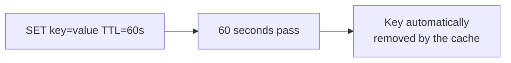
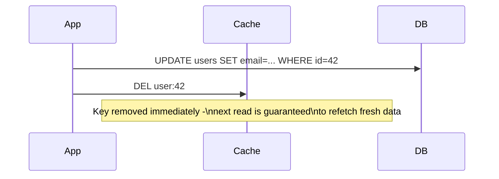

# Cache Invalidation — Junior

<!-- level-focus -->
At junior level, focus on this question:

> What's the difference between letting a cache entry expire and actively
> telling the cache it's wrong?

---

## Passive: TTL expiry



A TTL (time-to-live) is a passive mechanism — you set it once, and the cache
itself removes the entry after the timer runs out, with no further action
from your application required. This is simple, but it means a value can be
**wrong for up to the full TTL** before it's corrected, even if the
underlying data changed the instant after you cached it.

## Active: explicit invalidation



```python
def update_user_email(user_id, new_email):
    db.execute("UPDATE users SET email=%s WHERE id=%s", new_email, user_id)
    cache.delete(f"user:{user_id}")   # explicit, immediate invalidation
```

Instead of waiting for a timer, the application **tells the cache directly**
that a specific key is now stale, the moment it knows the underlying data
changed — closing the staleness window from "up to TTL seconds" down to
"as fast as this delete call executes."

> 🎓 **Takeaway:** TTL is a safety net that eventually corrects any cached
> value, with no code needed at write time. Explicit invalidation is a
> precise, immediate correction, but only for writes your application
> actually knows about and remembers to invalidate for. Production systems
> almost always use **both**: explicit invalidation for the common case, TTL
> as a backstop for anything that slips through (a direct DB write, a bug, a
> write from a system that doesn't know about the cache).

## Test yourself

1. If your application always remembers to call `cache.delete()` after every
   write, do you still need a TTL? Why or why not?
2. What happens if a database row is changed by a source your invalidation
   code doesn't know about (a script, a different service, an admin tool)?
3. Why is explicit invalidation alone, with no TTL, considered risky in
   production?

Continue to [`middle.md`](middle.md).
