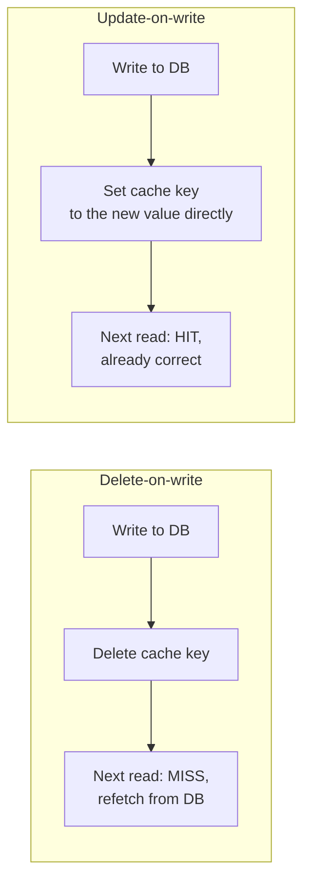

# Cache Invalidation — Middle

<!-- level-focus -->
At middle level, focus on this question:

> Should a write delete the cached key, or overwrite it with the new value —
> and when does each make more sense?

Prerequisite: [`junior.md`](junior.md).

---

## Delete-on-write (invalidate)

```python
def update_user(user_id, new_data):
    db.update(user_id, new_data)
    cache.delete(f"user:{user_id}")   # next reader repopulates it
```

Simple, and correct by construction — the next reader always fetches fresh
data from the database on a miss. The cost: the very next read after every
write pays a full cache-miss round trip, even though the application already
had the new value in hand at write time.

## Update-on-write (refresh)

```python
def update_user(user_id, new_data):
    db.update(user_id, new_data)
    cache.set(f"user:{user_id}", new_data)   # write the NEW value directly
```

Avoids the guaranteed miss — the cache is immediately correct with zero
extra database round trip, because the application already knows the new
value without needing to re-read it. This is essentially write-through's
approach (see [Write-Through](../02-write-through/README.md)) applied at the
invalidation layer.



## When to prefer each

| Signal | Favor |
|---|---|
| The cached value is exactly what you just wrote (simple field update) | Update-on-write — no reason to force a miss when you already have the correct value |
| The cached value is a **derived/computed** result (an aggregation, a joined view) that a single write doesn't fully determine | Delete-on-write — recomputing the derived value inline at write time would duplicate the read logic and risk drifting from it; simpler to just invalidate and let the normal read path recompute |
| Writes are much more frequent than reads for this key | Delete-on-write — updating the cache on every write when it's rarely read wastes cache-population work; let a real reader trigger it lazily instead |
| Reads are much more frequent than writes | Update-on-write — avoid forcing a miss on the (rare) write, since the (frequent) reads benefit most from never seeing one |

> 🎓 **Takeaway:** delete-on-write is the safer, simpler default for
> anything derived; update-on-write is a targeted optimization for
> read-heavy, directly-written values where you can cheaply construct the
> exact new cached value without a second query.

## Test yourself

1. Why is update-on-write risky for a cached value that's actually an
   aggregation over multiple rows, computed by a join?
2. For a write-heavy, rarely-read key, why does delete-on-write waste less
   work than update-on-write?
3. Rewrite the `update_user` example so it uses update-on-write, but only for
   the specific fields present in `new_data`, leaving other cached fields
   (from a wider cached object) untouched.

Continue to [`senior.md`](senior.md).
