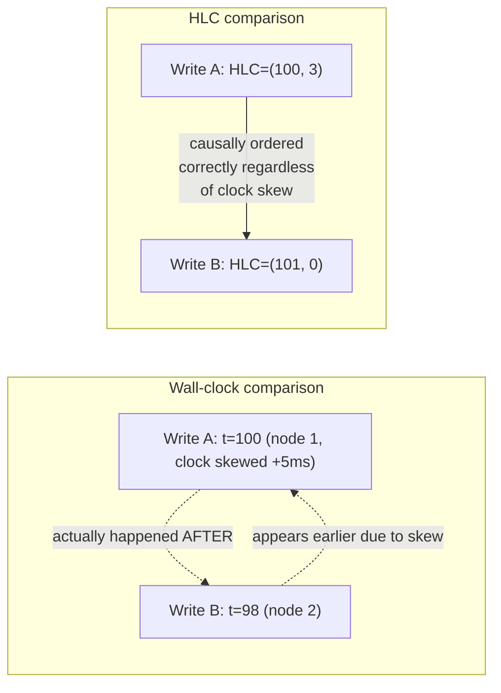
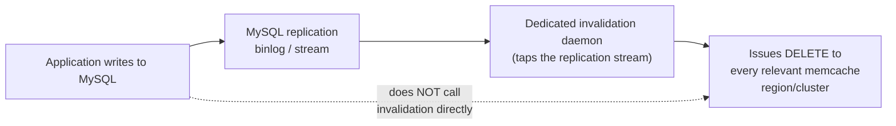

# Cache Invalidation — Professional

<!-- level-focus -->
At professional level, focus on this question:

> How do formal causal-consistency mechanisms (vector clocks, hybrid logical
> clocks) let a distributed system order invalidations correctly without a
> global clock, and why does Facebook's real production invalidation
> pipeline exist as a separate, hardened subsystem?

Prerequisite: [`senior.md`](senior.md).

---

## The ordering problem is a causality problem, not a timing problem

`senior.md`'s race (a stale read populating the cache after an invalidation)
is, formally, a **causality violation**: the cache-populating write and the
invalidating write have no enforced **happens-before** relationship, so
either can be observed as "last" depending on network/scheduling timing.
Wall-clock timestamps don't fix this — clock skew between nodes means
"later timestamp" doesn't reliably mean "causally later." The formally
correct primitive is a **logical clock**: a **Lamport clock** (a single
monotonic counter incremented on every event, guaranteeing "if A
happens-before B, then A's clock value < B's") establishes a partial causal
order without synchronized wall clocks at all. Production distributed
systems increasingly use **Hybrid Logical Clocks (HLC)** — combining a
physical wall-clock component with a logical counter — specifically so that
timestamps remain approximately human-meaningful (close to wall-clock time)
while still providing Lamport's happens-before guarantee, which a pure
physical timestamp comparison cannot.



Applying this to invalidation: attaching an HLC (or even a simple Lamport
counter) to both the cache-populating read's snapshot and the invalidation
event, and rejecting a cache-set whose logical timestamp is causally
*before* the most recent invalidation for that key, closes `senior.md`'s
race with a formally justified mechanism — not the heuristic "use a short
TTL" mitigation, but a provably correct one, at the cost of maintaining and
comparing logical clocks across every write path that touches the cache.

## Facebook's McSqueal / real production invalidation pipeline architecture

Facebook's own published architecture (the "Scaling Memcache at Facebook"
paper, and follow-on work) doesn't invalidate caches from application code
directly at all — it runs a **dedicated invalidation daemon (McSqueal)**
that **taps the MySQL replication stream** (functionally: a CDC pipeline
purpose-built for cache invalidation) and issues `DELETE` commands to
memcache **based on the committed replication log**, not based on
application code remembering to call an invalidation API after every write.
This is the same structural fix as the write-through professional page's
"CDC eliminates dual-write bugs by construction" — applied specifically to
invalidation: because invalidation is derived from the **already-committed,
already-ordered replication stream**, it inherits the database's own commit
ordering guarantee for free, and cannot race ahead of or behind the actual
committed state the way an application-triggered invalidation call can.



The professional-level lesson: **at Facebook's scale, "remember to call
`cache.delete()` after every write" was judged too unreliable to be the
sole invalidation mechanism** — a dedicated, replication-log-derived
invalidation system was built specifically because distributed application
code correctly invalidating a globally-distributed cache fleet, on every
code path, in every service, forever, is not an assumption a system at that
scale can safely make.

## Production checklist (staff-level)

1. **For any system where the `senior.md` race has caused (or could cause)
   a real incident, implement logical-clock-ordered (Lamport/HLC) cache
   writes** rather than relying solely on a short TTL heuristic — this is
   the formally correct fix, not just a mitigation.
2. **At meaningful scale, build (or adopt) a replication-log-derived
   invalidation pipeline** rather than depending on every write code path
   to remember to call an invalidation API — treat "engineers will always
   remember" as an assumption that fails at scale, based on documented
   industry precedent.
3. **Understand the specific consistency model your logical clock
   implementation provides** (Lamport clocks give a partial order sufficient
   for detecting *some* causality violations; vector clocks/HLC give a
   stronger, more precise causal ordering) and choose based on what your
   invalidation correctness actually requires.
4. **Treat a dedicated invalidation pipeline as critical infrastructure**
   with its own SLOs, on-call ownership, and incident response — at scale,
   it is as load-bearing for correctness as the primary database's
   replication itself.
5. **In a design review for a new cache-heavy service at meaningful scale,
   ask whether invalidation should be replication-log-derived from day
   one**, rather than retrofitting it after the first cross-service
   invalidation-race incident — this is a known, documented failure mode
   with a known, documented fix.

## Cheat Sheet

```text
+------------------------------------------------------------------+
|            CACHE INVALIDATION — INTERNALS & SCALE                   |
+------------------------------------------------------------------+
| The senior.md race is a CAUSALITY problem, not a timing problem -      |
| wall-clock timestamps don't fix it (clock skew breaks ordering).       |
| Lamport clocks: monotonic counter, guarantees happens-before order      |
| without synchronized clocks. HLC: physical+logical hybrid, keeps       |
| timestamps human-meaningful while preserving the happens-before        |
| guarantee - use these to formally close the race, not just short TTL  |
+------------------------------------------------------------------+
| Facebook's McSqueal: dedicated daemon TAPS THE MYSQL REPLICATION       |
| STREAM to issue cache invalidations, not application code calling      |
| an invalidation API after every write. Because it's derived from       |
| the ALREADY-COMMITTED, ALREADY-ORDERED replication log, it inherits    |
| correct ordering for free - cannot race ahead of or behind real state |
+------------------------------------------------------------------+
| At scale, "engineers will remember to invalidate on every write        |
| path forever" is not a safe assumption - build replication-log-        |
| derived invalidation as critical infrastructure, not an afterthought  |
+------------------------------------------------------------------+
```

## Test yourself

1. Explain why comparing wall-clock timestamps across two nodes cannot
   reliably determine causal order, and why a Lamport clock can.
2. Why does Facebook's McSqueal architecture (tapping the replication
   stream) eliminate the invalidation race from `senior.md` "for free,"
   the same way CDC eliminates dual-write bugs in the write-through
   professional page?
3. Design the logical-clock scheme you'd add to a cache-populating read
   and an invalidation event so that a `set_if_newer`-style cache write can
   correctly reject a causally-stale write, without relying on synchronized
   wall clocks.

## Further Reading

- Lamport — "Time, Clocks, and the Ordering of Events in a Distributed
  System" (1978 — the original logical clock paper).
- Kulkarni et al. — "Logical Physical Clocks and Consistent Snapshots in
  Globally Distributed Databases" (the Hybrid Logical Clock paper).
- Nishtala et al. — "Scaling Memcache at Facebook" (NSDI 2013 — McSqueal
  and the replication-log-derived invalidation architecture).
- See also: [Write-Through — professional](../02-write-through/professional.md).
