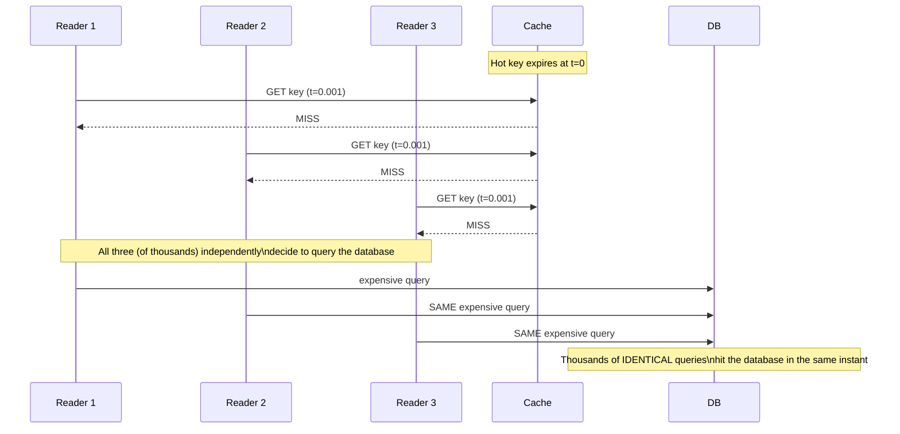

# Cache Stampede & Hot Keys — Junior

<!-- level-focus -->
At junior level, focus on this question:

> Why is a hot key's expiry uniquely dangerous, when a cold key's expiry is a
> non-event?

---

## Not all cache misses are equal

A cold key (requested rarely) expiring is harmless: the next, single request
for it pays one cache-miss database round trip, exactly as designed in
[Cache-Aside](../01-cache-aside/README.md). A **hot key** — one being read by
thousands of concurrent requests per second, like a homepage's "trending
now" list or a viral post's like count — behaves completely differently when
it expires.

Every one of the key's concurrent readers gets a miss at the same instant,
and — following the standard cache-aside pattern from `junior.md` of that
topic — every single one of them independently queries the database and
tries to repopulate the cache. This is called a **cache stampede**, **dogpile
effect**, or **thundering herd**: one expired key turns into thousands of
simultaneous, completely redundant database queries, which can overwhelm a
database that was otherwise comfortably handling load.

> 🎓 **Takeaway:** the danger of a stampede scales with how popular the key
> is, not with how expensive the query behind it is (though an expensive
> query makes it worse). A cheap query run 10,000 times simultaneously is
> still 10,000x the load the cache was supposed to be absorbing.

## Test yourself

1. Why doesn't a cold key (read once every few minutes) ever cause a
   stampede, even with the exact same cache-aside code?
2. If a stampede happens, what's the difference between "the database is
   slow because of the stampede" and "the database is slow because the query
   itself is slow"?
3. Estimate the database load multiplier for a key normally read once per
   TTL cycle by 5,000 concurrent users, if it stampedes on every expiry.

Continue to [`middle.md`](middle.md).
