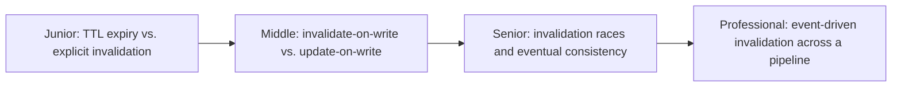
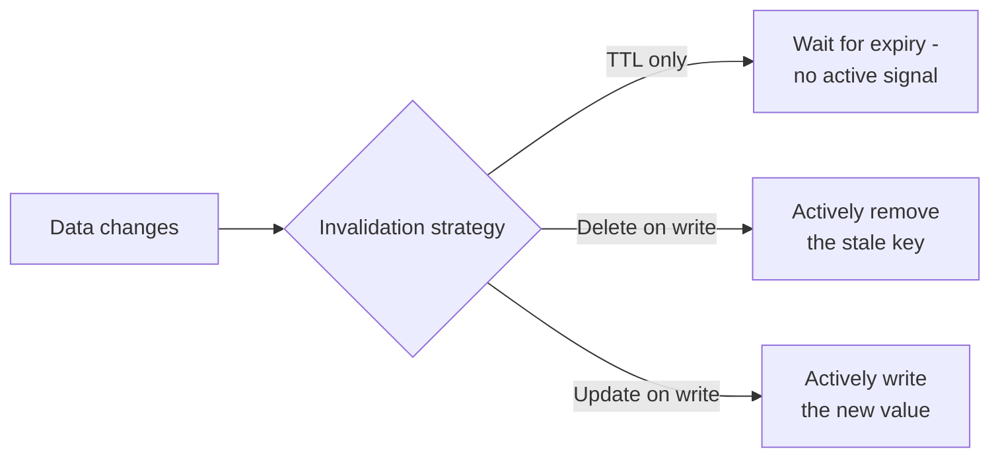

# Cache Invalidation

> "There are only two hard things in Computer Science: cache invalidation and
> naming things." Deciding *when* a cached value is no longer valid, and
> reliably telling every copy of it, is one of the most quietly
> bug-prone problems in distributed systems.

## Choose a level

| Level | Guide | You are done when |
|---|---|---|
| Junior | [TTL vs. explicit invalidation](junior.md) | You can explain the difference between passive expiry and active invalidation. |
| Middle | [Delete-on-write vs. update-on-write](middle.md) | You can pick between them for a given write pattern. |
| Senior | [Invalidation races](senior.md) | You can construct a race where invalidation and a concurrent read leave the cache wrong. |
| Professional | [Event-driven invalidation](professional.md) | You can design invalidation propagation using a pipeline's own event stream. |

## Practice rule

For any cache you invalidate on write, ask: "what happens if a read that
started before the write finishes after the invalidation?" If you can't
answer precisely, you likely have the exact race covered in `senior.md`,
whether or not you've seen it manifest yet.

## Related

- [Cache-Aside](../cache-aside/README.md)
- [Types of Caching](../types-of-caching/README.md)
- [Cache Stampede & Hot Keys](../cache-stampede-and-hot-keys/README.md)
