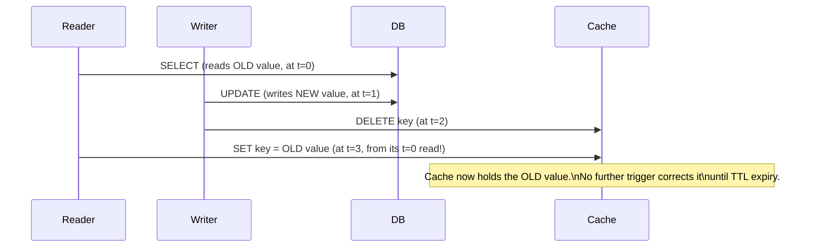
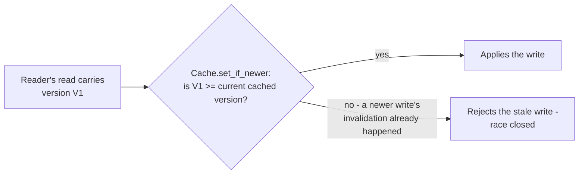

# Cache Invalidation — Senior

<!-- level-focus -->
At senior level, focus on this question:

> How can a concurrent read and invalidation race to leave the cache
> permanently wrong, and how do you close that window?

Prerequisite: [`middle.md`](middle.md).

---

## This is the same race from Cache-Aside — senior, generalized

[Cache-Aside — senior](../cache-aside/senior.md) already walked through
one instance of this: a reader that read the old value **before** a write,
but populates the cache **after** the write's invalidation, leaving the
stale value cached with nothing left to correct it until TTL expiry.



## Closing the window: versioned, conditional writes

The general fix is to make the cache write **conditional on freshness**,
not unconditional — attach a version (or timestamp) to both the read and the
cache write, and only allow the cache-set to succeed if no newer write has
happened since the read began.

```python
def get_user(user_id):
    row, db_version = db.query_with_version(
        "SELECT *, xmin AS version FROM users WHERE id=%s", user_id)
    cache.set_if_newer(f"user:{user_id}", row, version=db_version)
    return row

# cache.set_if_newer only applies the write if the incoming version is
# >= the version of whatever's currently cached (or currently absent)
```



This mirrors the optimistic concurrency control pattern from
[Locking & Concurrency Control — senior](../../../transaction/locking-and-concurrency-control/senior.md):
instead of preventing the race through locking (expensive, and this is a
cache, not a transactional resource), detect and reject the stale write at
the moment it would apply.

## When the version-check machinery isn't worth it

For most applications, the race window is genuinely narrow (microseconds to
low milliseconds between a read starting and a concurrent write's
invalidation landing) and the practical mitigation is simply: **always pair
explicit invalidation with a reasonably short TTL**, per
[Cache-Aside — senior](../cache-aside/senior.md)'s recommendation. Reserve
the versioned-write machinery for keys where even a brief window of
incorrect-until-TTL data is unacceptable (financial balances, inventory
counts, anything feeding a downstream decision with real consequences).

> 🎯 **Senior takeaway:** invalidation races are real and exploitable under
> load, but the cost of fully closing them (version tracking on every cache
> write) isn't justified for every key. Default to a short TTL backstop;
> reserve versioned conditional writes for keys where staleness has a real
> business cost.

## Test yourself

1. Walk through the exact timing that has to occur for the race in the
   sequence diagram to manifest — how tight does the window need to be?
2. Why does `set_if_newer` need a version comparison, rather than just
   checking "does this key already exist"?
3. Give one cached value in a real system where you'd justify the versioned
   conditional-write machinery, and one where a plain short TTL is
   sufficient.

Continue to [`professional.md`](professional.md) to design event-driven
invalidation propagation across a data pipeline.
