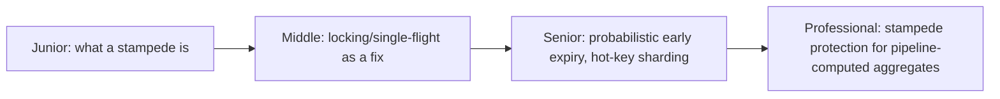
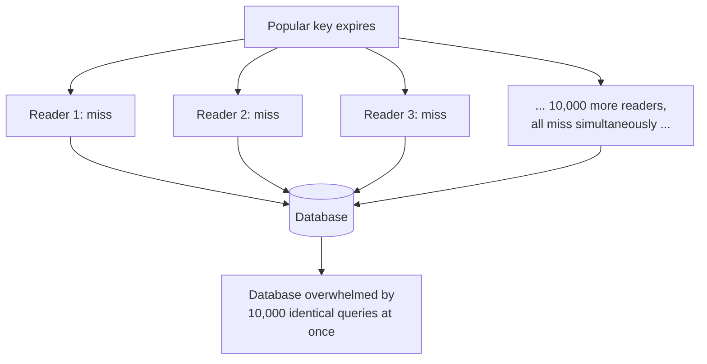

# Cache Stampede & Hot Keys

> When a popular cache key expires, every one of its thousands of concurrent
> readers can simultaneously fall through to the database at once —
> converting one missing cache entry into an instant database overload
> ("dogpile" or "thundering herd").

## Choose a level

| Level | Guide | You are done when |
|---|---|---|
| Junior | [What a stampede is](junior.md) | You can explain why a hot key's expiry is uniquely dangerous compared to a cold key's. |
| Middle | [Single-flight locking](middle.md) | You can design a mechanism where only one request recomputes a value while others wait or serve stale. |
| Senior | [Probabilistic early expiry](senior.md) | You can explain how spreading refreshes over time avoids a synchronized expiry storm. |
| Professional | [Protecting pipeline aggregates](professional.md) | You can design stampede protection for a hot, pipeline-computed value under real production load. |

## Practice rule

For any cache key you expect to be extremely hot, ask: "what happens to the
database in the exact millisecond this key expires, if 10,000 requests are
in flight for it right now?" If the honest answer is "they'd all hit the
database at once," you need stampede protection before that key goes live.

## Related

- [Cache-Aside](../cache-aside/README.md)
- [Refresh-Ahead](../refresh-ahead/README.md)
- [Eviction Policies](../eviction-policies/README.md)
