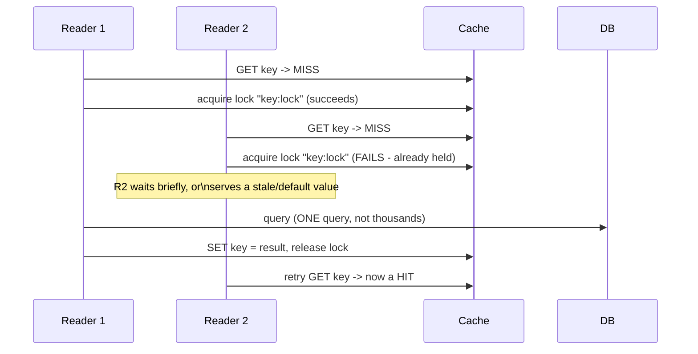
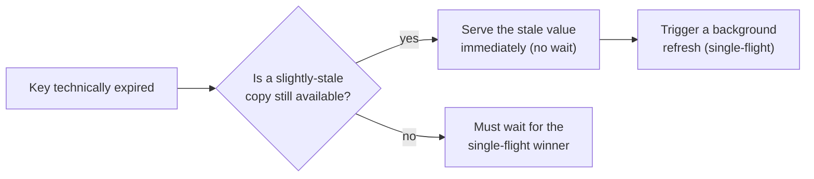

# Cache Stampede & Hot Keys — Middle

<!-- level-focus -->
At middle level, focus on this question:

> How does letting exactly one request recompute the value, while everyone
> else waits or gets a stale copy, prevent a stampede?

Prerequisite: [`junior.md`](junior.md).

---

## Single-flight / locking pattern



```python
def get_with_stampede_protection(key):
    value = cache.get(key)
    if value is not None:
        return value

    if cache.acquire_lock(f"{key}:lock", ttl=5):
        try:
            value = db.query(...)
            cache.set(key, value, ttl=60)
        finally:
            cache.release_lock(f"{key}:lock")
        return value
    else:
        # someone else is already recomputing it - wait briefly and retry,
        # or serve a stale value if one exists
        time.sleep(0.05)
        return cache.get(key) or db.query(...)  # fallback, rare path
```

Only the **first** request to notice the miss acquires the recompute lock and
actually queries the database; every other concurrent request either waits a
short moment and retries the cache (now populated by the winner), or falls
back to serving a slightly stale value if one is available. This converts
"thousands of simultaneous database queries" into **exactly one**.

## Serving stale-while-revalidating as an alternative



Rather than making non-winning requests wait, many production caches keep a
slightly-expired value around for a grace period and serve it immediately to
anyone who misses, while a single background request refreshes it — this is
"stale-while-revalidate," a close cousin of the pattern already covered
conceptually in [Refresh-Ahead](../refresh-ahead/README.md), applied
reactively at miss time instead of proactively before expiry.

> 🎓 **Takeaway:** the core mechanism is the same either way — ensure only
> **one** request does the expensive recompute work, no matter how many
> requests are simultaneously interested in the result. Everything else is a
> decision about what the other requests should do while they wait: block
> briefly, or serve something slightly stale.

## Test yourself

1. Why must the lock in the code example have its own TTL, separate from the
   cache key's TTL?
2. What happens if the process holding the recompute lock crashes before
   releasing it — how does the lock's own TTL protect against a permanent
   deadlock?
3. Compare the user experience of "wait 50ms and retry" versus
   "stale-while-revalidate" for a request that arrives during the recompute
   window.

Continue to [`senior.md`](senior.md).
