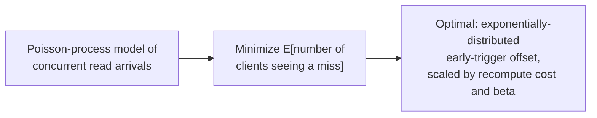
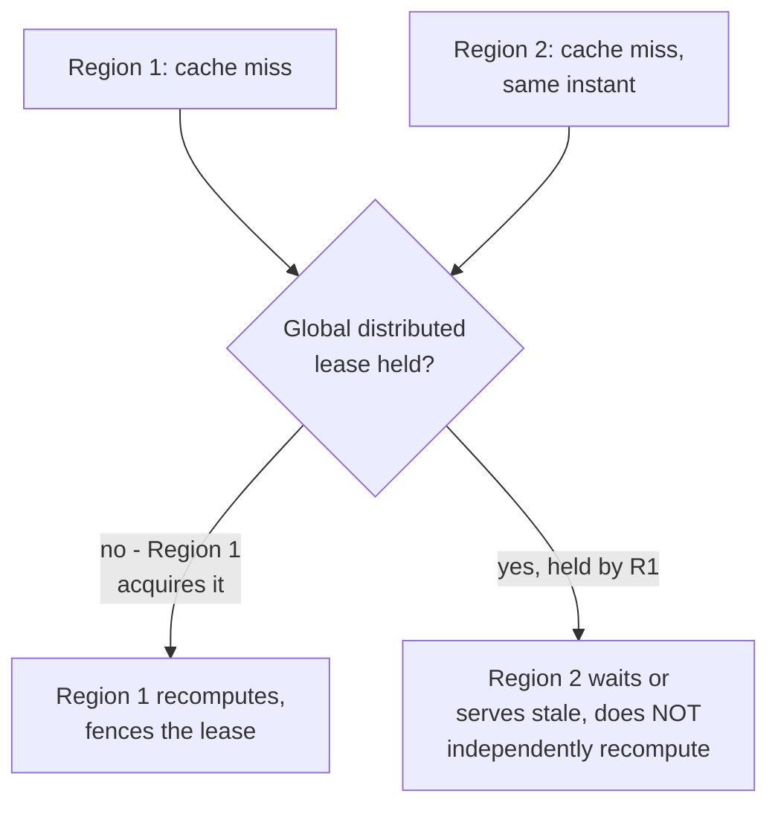

# Cache Stampede & Hot Keys — Professional

<!-- level-focus -->
At professional level, focus on this question:

> What is the formal mathematics behind probabilistic early expiration
> (the XFetch paper's actual derivation), and how do real systems implement
> distributed single-flight across multiple processes/hosts, not just one?

Prerequisite: [`senior.md`](senior.md).

---

## XFetch's actual formula, derived

Vattani, Chierichetti, and Lowenstein's "Optimal Probabilistic Cache
Stampede Prevention" (VLDB 2015) derives the specific early-recomputation
trigger used in production (and referenced informally in `senior.md`):

```
delta = beta * compute_cost * -ln(rand())
recompute_early if (now - computed_at + delta) >= ttl
```

The `-ln(rand())` term is drawn from an **exponential distribution** — this
isn't an arbitrary choice: the paper proves that using an exponentially
distributed random early-trigger offset, scaled by the recomputation cost,
**minimizes the expected number of clients that ever see a cache miss**,
across the whole population of concurrent readers, under a Poisson-process
model of request arrivals. The `beta` parameter tunes aggressiveness:
`beta=1` is the paper's theoretically-derived optimum under the stated
model assumptions; production systems often tune it empirically against
observed miss rates rather than assuming the model's assumptions hold
exactly for real traffic. The professional-level point: this isn't a
folklore heuristic — it's a specific, published, mathematically-justified
result, and using an *ad hoc* different random distribution ("just add
random jitter") does not carry the same optimality guarantee, even though
it captures the qualitative spirit of "spread refreshes out."



## Distributed single-flight: the problem `middle.md`'s lock doesn't solve alone

A single Redis-based lock (`middle.md`'s pseudocode) works when all
application instances share one cache backend — but at large scale with
**multiple independent cache tiers** (per-datacenter Redis clusters, or a
CDN plus a regional application cache plus a database), the recompute lock
must itself be **globally coordinated**, or each tier independently
stampedes its own upstream. Production systems solve this with a
**distributed lease**, structurally identical to the leader-election
professional page's fencing-token pattern: the winning recomputation holds
a lease (a TTL'd key with a unique fencing token) recognized across all
regions via a strongly-consistent coordination layer (etcd, ZooKeeper, or
the cache backend's own atomic `SET NX` semantics replicated appropriately),
and every tier checks that same lease before independently deciding to
recompute — collapsing what would otherwise be N independent single-flight
domains (one per region/tier) into one global one.



## Real production case study pattern: the "cold cache after failover" compound failure

A well-documented production failure pattern combines several mechanisms
from this whole topic tree: a regional failover (see reliability patterns)
routes traffic to a previously-cold standby region whose cache is entirely
empty; every hot key across the entire traffic volume misses simultaneously
(the stampede from `junior.md`, but region-wide, not per-key); without
distributed single-flight coordination *and* a pre-warming strategy, the
newly-active region's backing store receives a synchronized full-traffic
stampede at the exact moment it's already under failover-related load —
compounding two independent risk factors (cold cache + failover load) into
an outage that neither factor alone would have caused. The professional-level
mitigation combines: pre-warming the standby region's cache proactively (via
the same replication-log-derived pipeline pattern from the cache
invalidation professional page, kept warm continuously rather than cold
until failover), plus distributed single-flight as the last line of defense
if pre-warming is incomplete at failover time.

## Production checklist (staff-level)

1. **Use the XFetch formula's actual derivation (exponential early-trigger
   offset scaled by cost) rather than an ad hoc jitter scheme**, when
   implementing probabilistic early refresh for genuinely high-value hot
   keys — it carries a real optimality proof under stated assumptions,
   which an arbitrary jitter distribution does not.
2. **Implement distributed single-flight via a globally-coordinated lease
   with a fencing token** (not a per-region/per-tier independent lock) for
   any system with multiple cache tiers or regions sharing a backing store —
   otherwise each tier can independently stampede in parallel.
3. **Proactively pre-warm standby/failover regions' caches on an ongoing
   basis** (via a replication-log-derived pipeline, not a point-in-time
   snapshot) rather than treating cache warmth as something that only
   matters after failover — this converts a compound cold-cache-plus-failover
   risk into a single, independently-manageable one.
4. **Explicitly test the cold-cache-during-failover compound scenario** in
   game days/chaos engineering exercises, not just steady-state stampede
   scenarios — the failure mode only appears when both conditions coincide,
   which a stampede-only test won't surface.
5. **In a postmortem for a failover-triggered outage, check for this
   specific compound pattern (cold cache + failover load) explicitly**
   before attributing the outage solely to the failover mechanism itself —
   the two independent risk factors are individually well-understood but
   combine non-obviously.

## Cheat Sheet

```text
+------------------------------------------------------------------+
|          CACHE STAMPEDE & HOT KEYS — INTERNALS & SCALE               |
+------------------------------------------------------------------+
| XFetch (Vattani/Chierichetti/Lowenstein, VLDB 2015): exponentially-    |
| distributed early-trigger offset, scaled by recompute cost, PROVABLY   |
| minimizes expected clients seeing a miss under a Poisson arrival       |
| model - not folklore, a specific derived optimum. Ad hoc jitter        |
| captures the spirit but not the optimality guarantee                  |
+------------------------------------------------------------------+
| Distributed single-flight across multiple cache tiers/regions needs    |
| a GLOBALLY-COORDINATED LEASE with a fencing token (same pattern as     |
| leader election), not N independent per-tier locks - otherwise each    |
| tier can stampede its own upstream in parallel                         |
+------------------------------------------------------------------+
| Compound failure: cold-cache failover region + failover-related load   |
| = a worse outage than either factor alone. Mitigate by continuously    |
| PRE-WARMING standby regions via a replication-log-derived pipeline,    |
| with distributed single-flight as the last line of defense             |
+------------------------------------------------------------------+
```

## Test yourself

1. Why does using `-ln(rand())` (an exponential distribution) for the early-
   refresh offset carry a specific mathematical guarantee that a uniform
   random jitter does not?
2. Design a distributed lease scheme (using a fencing token) so that only
   one of three regional cache tiers recomputes an expired global hot key,
   while the other two wait or serve stale data.
3. Explain why a cold-cache failover incident is a compound failure of two
   independently well-understood mechanisms, and how continuous pre-warming
   changes the failure's shape.

## Further Reading

- Vattani, Chierichetti, Lowenstein — "Optimal Probabilistic Cache
  Stampede Prevention" (VLDB 2015 — the XFetch paper with the full
  derivation).
- See also: [Leader Election — professional](../../../distributed-system/consensus/leader-election/professional.md)
  (the fencing-token pattern reused here), [Cache Invalidation — professional](../cache-invalidation/professional.md)
  (the replication-log-derived warming pipeline pattern).
