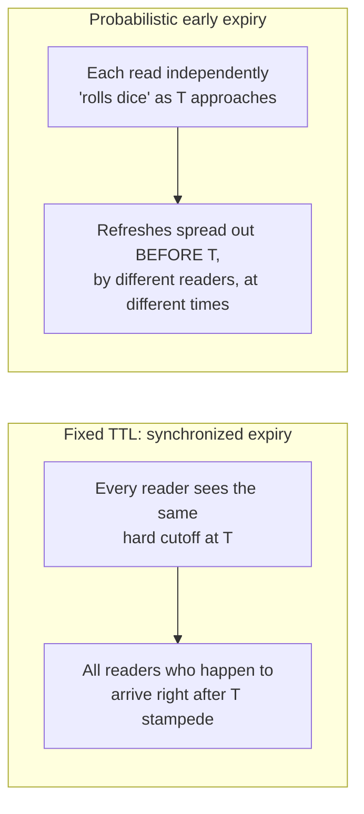
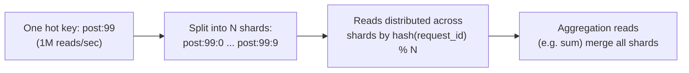

# Cache Stampede & Hot Keys — Senior

<!-- level-focus -->
At senior level, focus on this question:

> How do you prevent many keys from expiring in a synchronized burst in the
> first place, rather than just handling each expiry's stampede after the
> fact?

Prerequisite: [`middle.md`](middle.md).

---

## Probabilistic early expiry (XFetch)

Instead of treating a key as strictly valid-until-TTL and invalid-after,
have each read **probabilistically decide to refresh early**, with
probability increasing as the key approaches its real expiry — spreading
refreshes out over time instead of concentrating them at the exact expiry
instant.

```python
import random, math

def get_with_probabilistic_refresh(key):
    entry = cache.get_with_metadata(key)  # value, computed_at, ttl, compute_cost
    if entry is None:
        return recompute_and_cache(key)

    elapsed = now() - entry.computed_at
    # XFetch: refresh probability rises as we approach TTL, scaled by
    # how expensive the recompute is (beta tunes aggressiveness)
    delta = entry.compute_cost * BETA * -math.log(random.random())
    if elapsed + delta >= entry.ttl:
        return recompute_and_cache(key)   # this reader "wins" the early refresh
    return entry.value
```



Because the probability rises gradually rather than triggering at one exact
instant, different requests "win" the early refresh at different, spread-out
moments — no single instant sees a synchronized flood, and by the time the
key would have actually expired, it's very likely already been refreshed.

## Correlated TTL problem (from Refresh-Ahead — senior, revisited)

The same correlated-TTL storm covered in
[Refresh-Ahead — senior](../refresh-ahead/senior.md) is a direct cause of
stampedes at scale: if a bulk cache warm-up gives thousands of keys the exact
same TTL, they don't just refresh together (wasteful) — they can **expire**
together, and if refresh-ahead didn't catch all of them in time, each one
independently stampedes at the same instant. **Jitter is not optional for
any bulk-populated set of hot keys** — it's the single cheapest defense
against this entire failure class.

## Sharding a single hot key

Some keys are hot not because many keys share a TTL, but because **one**
key is read at extreme volume (a single viral post's counter, a single
celebrity user's profile) — even single-flight locking (`middle.md`) means
every request funnels through one lock on one key, which can itself become
a bottleneck at sufficient scale.



Sharding a single hot key across N sub-keys (each holding a partial value,
or the same value replicated across shards for read-only data) distributes
the read load — and, for write-heavy counters, distributes the write
contention too, echoing the hot-partition mitigation from
[NoSQL Modeling — senior](../../../data-modeling/nosql-modeling/senior.md).

> 🎯 **Senior takeaway:** `middle.md`'s single-flight lock fixes the
> "thousands of readers stampede the database" problem. This page fixes the
> upstream causes: synchronized expiry (via jitter/probabilistic refresh) and
> single-key read/write bottlenecks (via sharding) — both reduce how often
> and how severely a stampede scenario even arises.

## Test yourself

1. Why does XFetch's probability need to depend on `compute_cost`, not just
   elapsed time — what would go wrong with a fixed refresh probability
   regardless of how expensive the recompute is?
2. Trace through why jittering TTLs at bulk-population time prevents the
   correlated stampede, even without any per-read probabilistic logic.
3. For a single celebrity user's profile read a million times per second,
   why might single-flight locking alone still be insufficient, and how does
   sharding help?

Continue to [`professional.md`](professional.md) to protect a real,
pipeline-computed hot aggregate under production load.
