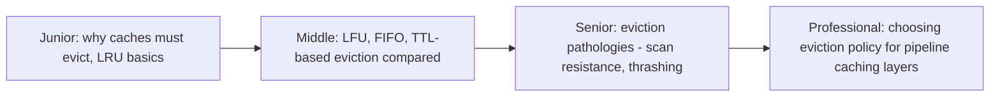
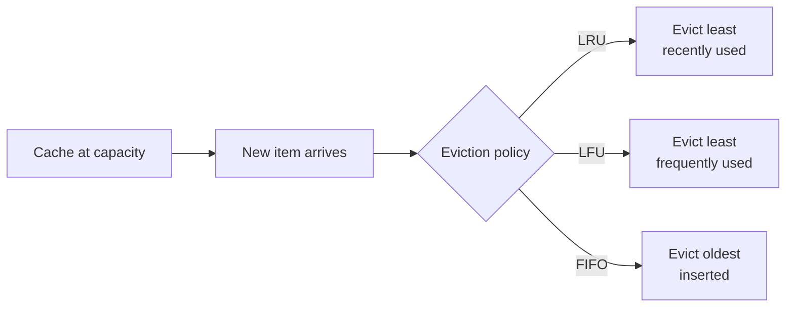

# Cache Eviction Policies

> A cache is finite; the data you'd like to cache usually isn't. Eviction
> policies decide what gets thrown out when the cache is full — and picking
> the wrong one can quietly tank your hit rate without any code looking
> "wrong."

## Choose a level

| Level | Guide | You are done when |
|---|---|---|
| Junior | [Why eviction exists, LRU](junior.md) | You can trace an LRU eviction through a small example. |
| Middle | [Comparing policies](middle.md) | You can pick the right policy (LRU/LFU/FIFO/TTL) for a given access pattern. |
| Senior | [Pathologies](senior.md) | You can explain scan resistance and why a single bulk read can wreck an LRU cache. |
| Professional | [Choosing for pipeline caching](professional.md) | You can pick and justify an eviction policy for a feature-store or pipeline-output cache. |

## Practice rule

Before trusting any eviction policy, ask: "what access pattern would make
this policy evict the wrong thing?" Every policy has one — knowing it in
advance is the difference between debugging a mysterious hit-rate drop and
having already designed around it.

## Related

- [Cache-Aside](../cache-aside/README.md)
- [Types of Caching](../types-of-caching/README.md)
