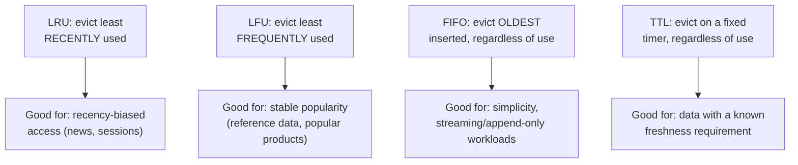
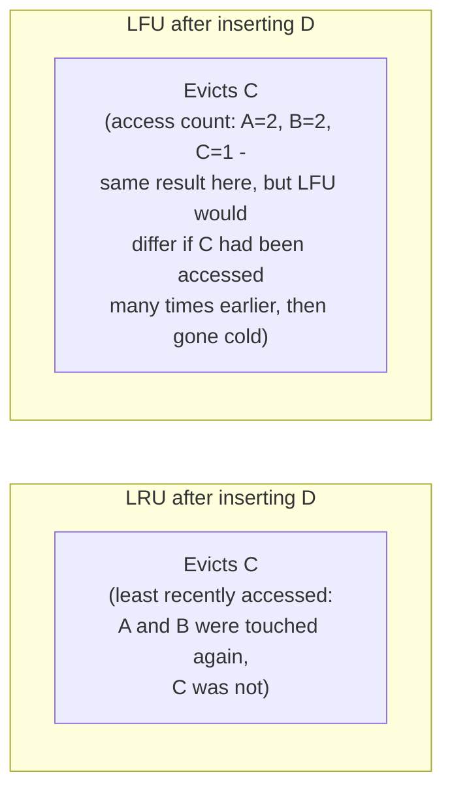

# Cache Eviction Policies — Middle

<!-- level-focus -->
At middle level, focus on this question:

> How do LFU, FIFO, and TTL-based eviction differ from LRU, and which access
> pattern favors each?

Prerequisite: [`junior.md`](junior.md).

---

## The policy comparison

| Policy | Eviction criterion | Weakness |
|---|---|---|
| **LRU** | Time since last access | A one-time bulk scan of cold data can evict genuinely hot items (see `senior.md`) |
| **LFU** | Access count (often with decay over time) | Slow to adapt — an item popular last week but cold today can stay cached, crowding out newly-popular items ("aging" schemes mitigate this) |
| **FIFO** | Insertion time, ignores access pattern entirely | Simple and cheap, but can evict a frequently-used item just because it happened to be inserted early |
| **TTL-based** | A fixed expiry, independent of access | Predictable staleness bound (ties directly into [Cache-Aside — middle](../cache-aside/middle.md)), but can evict still-popular data purely because time passed |

## Worked comparison: LRU vs. LFU on the same access sequence

Access sequence: `A, B, C, A, B, D` (cache capacity = 3)

LRU and LFU often agree on simple sequences, but diverge sharply when an item
was **very** popular in the past and then goes cold — LFU (without a decay
mechanism) keeps it cached long after it stopped mattering, purely because of
its historical count; LRU evicts it quickly once access stops, because LRU
only cares about *recency*, not cumulative history.

> 🎓 **Takeaway:** there's no universally best policy — it's a bet about
> your access pattern's shape. LRU bets on recency predicting the future;
> LFU bets on cumulative popularity predicting the future; FIFO and TTL don't
> bet on access patterns at all, trading potential hit-rate for simplicity
> and predictability.

## Test yourself

1. Give a real access pattern where LFU would clearly outperform LRU (a case
   where "popular in general" matters more than "used recently").
2. Give a real access pattern where LRU would clearly outperform LFU.
3. Why might a production cache combine TTL with LRU (evict on whichever
   comes first) rather than choosing only one?

Continue to [`senior.md`](senior.md).
