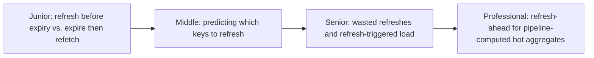
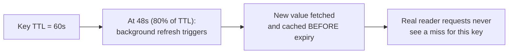

# Refresh-Ahead Caching

> Instead of waiting for a key to expire and forcing the next reader to eat a
> cache miss, proactively refresh hot keys shortly before their TTL runs
> out — so real users almost never see a miss for popular data.

## Choose a level

| Level | Guide | You are done when |
|---|---|---|
| Junior | [Refresh before expiry](junior.md) | You can explain why refresh-ahead avoids the miss that cache-aside can't. |
| Middle | [Deciding which keys to refresh](middle.md) | You can design a heuristic for which keys deserve proactive refresh. |
| Senior | [Wasted refreshes](senior.md) | You can quantify when refresh-ahead wastes more work than it saves. |
| Professional | [Refresh-ahead for pipeline aggregates](professional.md) | You can design refresh-ahead for a hot, pipeline-computed aggregate serving live traffic. |

## Practice rule

Before adding refresh-ahead for a key, check its actual read frequency. If
nobody's requesting it between refreshes, you're paying refresh cost for
zero benefit — refresh-ahead only pays off for genuinely hot keys.

## Related

- [Cache-Aside](../cache-aside/README.md)
- [Cache Stampede & Hot Keys](../cache-stampede-and-hot-keys/README.md)
